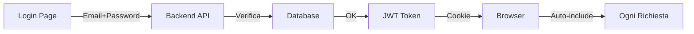

# 🔐 GUIDA AUTENTICAZIONE PILOTPROOS

## 📱 COME ACCEDERE AL SISTEMA

### 1️⃣ **ACCESSO VIA BROWSER (Metodo Standard)**

1. Apri il browser
2. Vai a: **http://localhost:3000**
3. Verrai reindirizzato automaticamente a `/login`
4. Inserisci:
   - **Email**: `tiziano@gmail.com`
   - **Password**: (la tua password personale)
5. Click su "Login"
6. Sei dentro! 🎉

### 2️⃣ **DOVE SONO MEMORIZZATE LE CREDENZIALI**

Le credenziali NON sono salvate nel codice ma nel **DATABASE PostgreSQL**:

```sql
-- Tabella: pilotpros.users
-- Le password sono hashate con bcrypt (12 rounds)
-- NON sono mai salvate in chiaro
```

**Utenti attuali nel sistema:**
- `tiziano@gmail.com` - Admin
- `Ginolatino` - Admin

---

## 🔄 COME FUNZIONA L'AUTENTICAZIONE

### **FLUSSO AUTOMATICO:**



### **TOKEN AUTOMATICI:**

Una volta fatto login, il sistema gestisce TUTTO automaticamente:

1. **Access Token** (15 minuti)
   - Salvato in HttpOnly cookie
   - Si rinnova automaticamente
   - Non devi fare nulla

2. **Refresh Token** (7 giorni)
   - Rinnova l'access token
   - Logout automatico dopo 7 giorni

---

## 🛡️ PROTEZIONI ATTIVE

### **Rate Limiting:**
- ❌ Max 5 tentativi login in 15 minuti
- ⏱️ Delay progressivo dopo ogni tentativo fallito
- 🔒 Account bloccato temporaneamente dopo 5 errori

### **Route Protette:**
TUTTE le route `/api/business/*` richiedono autenticazione:
- ✅ `/api/business/processes`
- ✅ `/api/business/executions`
- ✅ `/api/business/analytics`
- ✅ Tutte le altre...

---

## 🔧 GESTIONE PASSWORD

### **Cambiare Password (da CLI):**

```bash
# Usa lo script dedicato
cd backend
node scripts/change-password.js tiziano@gmail.com NuovaPassword123!
```

### **Cambiare Password (da UI):**
1. Login nel sistema
2. Vai su Settings/Profile
3. Cambia password

### **Reset Password (se dimenticata):**
```bash
# Direttamente nel database
docker exec -it pilotpros-postgres psql -U pilotpros_user -d pilotpros_db

-- Genera nuovo hash per "NuovaPassword123!"
-- Usa: https://bcrypt-generator.com/ con 12 rounds
UPDATE pilotpros.users
SET password_hash = '$2b$12$...(nuovo hash)...'
WHERE email = 'tiziano@gmail.com';
```

---

## 🚀 API TESTING CON CURL

### **Login via API:**
```bash
curl -X POST http://localhost:3001/api/auth/login \
  -H "Content-Type: application/json" \
  -d '{"email":"tiziano@gmail.com","password":"TuaPassword"}' \
  --cookie-jar cookies.txt
```

### **Usare API con Token:**
```bash
# Il cookie viene incluso automaticamente
curl http://localhost:3001/api/business/processes \
  --cookie cookies.txt
```

---

## 🔴 PROBLEMI COMUNI

### **"Credenziali non valide"**
- Verifica la password sia corretta
- Controlla maiuscole/minuscole
- Verifica l'email sia giusta

### **"Too many attempts"**
- Aspetta 15 minuti
- O riavvia il backend: `docker restart pilotpros-backend`

### **"Token expired"**
- Fai logout e login di nuovo
- Il sistema dovrebbe auto-rinnovare, se non funziona riporta il bug

---

## 📝 CONFIGURAZIONE UTENTI

### **Aggiungere Nuovo Utente:**

```javascript
// Via API (richiede admin auth)
POST /api/auth/register
{
  "email": "nuovo@utente.com",
  "password": "Password123!",
  "role": "user"
}
```

### **Ruoli Disponibili:**
- `admin` - Accesso completo
- `user` - Accesso standard
- `readonly` - Solo lettura

---

## 🔒 SICUREZZA

**MAI fare:**
- ❌ Salvare password in chiaro
- ❌ Condividere token JWT
- ❌ Disabilitare auth in produzione

**SEMPRE fare:**
- ✅ Usare HTTPS in produzione
- ✅ Cambiare JWT_SECRET nel .env
- ✅ Abilitare 2FA quando disponibile

---

## 📞 SUPPORTO

Problemi di accesso? Contatta:
- Admin Sistema: admin@pilotproos.com
- Documentazione: `/docs`
- Logs: `docker logs pilotpros-backend`

---

*Ultima modifica: 2025-09-19*