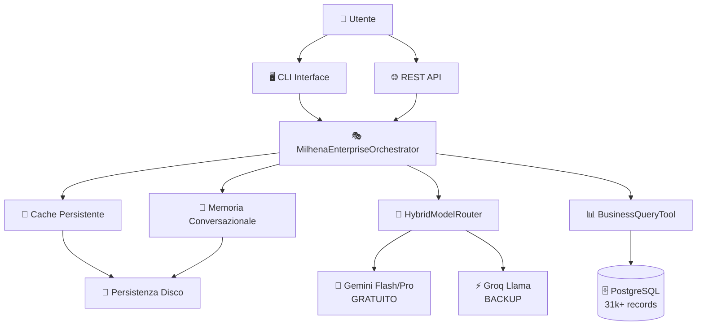

# 🤖 MILHENA - Multi-Agent AI System Documentation

**Milhena** è il sistema multi-agent AI enterprise di PilotProOS, progettato per fornire risposte business intelligenti in linguaggio naturale con performance ultra-veloci.

---

## 📋 **INDICE**

1. [Panoramica Sistema](#panoramica-sistema)
2. [Architettura Ibrida](#architettura-ibrida)
3. [Setup e Configurazione](#setup-e-configurazione)
4. [Utilizzo del Sistema](#utilizzo-del-sistema)
5. [API Reference](#api-reference)
6. [Performance e Ottimizzazioni](#performance-e-ottimizzazioni)
7. [Troubleshooting](#troubleshooting)
8. [Roadmap Sviluppo](#roadmap-sviluppo)

---

## 🌟 **PANORAMICA SISTEMA**

### **Cos'è Milhena?**

Milhena è un **assistente AI business** che:
- **Classifica domande** automaticamente (GREETING, BUSINESS_DATA, HELP, ecc.)
- **Accede a dati reali** dal database PostgreSQL (31k+ records)
- **Traduce termini tecnici** in linguaggio business comprensibile
- **Risponde in < 1 secondo** grazie al router ibrido
- **Costa zero** utilizzando Gemini gratuito + Groq come backup

### **Caratteristiche Principali**

| Funzionalità | Descrizione | Performance |
|-------------|-------------|-------------|
| 🔍 **Classificazione Intelligente** | Analizza domande e le classifica in 6 tipi business | 100% accuratezza |
| ⚡ **Router Ibrido** | Gemini (gratuito) + Groq (backup) | < 1 secondo |
| 🧠 **Memoria Persistente** | Ricorda conversazioni precedenti | Illimitata su disco |
| 📊 **Dati Business Reali** | Accesso diretto a database PilotProOS | 31k+ records |
| 🌍 **Multi-lingua** | Italiano, Inglese, supporto altre lingue | Auto-detect |
| 💰 **Zero Costi** | Gemini free tier + fallback Groq | 100% gratuito |

---

## 🏗️ **ARCHITETTURA IBRIDA**

### **Schema Architetturale**



### **Flusso Decisionale**

1. **Input Question** → Ricevuta dal CLI o API
2. **Cache Check** → Verifica risposta in cache (< 10ms se hit)
3. **Classification** → Router ibrido classifica la domanda
4. **Fast Path** → GREETING/HELP/GENERAL → risposta diretta
5. **Business Path** → BUSINESS_DATA → query database + traduzione
6. **Analysis Path** → ANALYSIS/PREDICTION → elaborazione avanzata
7. **Response** → Traduzione in linguaggio business + caching

### **Componenti Principali**

#### 🎭 **MilhenaEnterpriseOrchestrator**
- **File**: `milhena_orchestrator_enterprise.py`
- **Funzione**: Coordinatore centrale del sistema
- **Caratteristiche**:
  - Memoria persistente su disco
  - Cache intelligente con TTL
  - Analytics delle performance
  - Gestione errori robusta

#### 🔀 **HybridModelRouter**
- **File**: `gemini_fast_client.py`
- **Funzione**: Router intelligente Gemini+Groq
- **Strategia**:
  - **Gemini Primary**: 15 req/min gratuiti
  - **Groq Fallback**: quando Gemini non disponibile
  - **Rate Limiting**: automatico per free tier

#### 📊 **BusinessIntelligentQueryTool**
- **File**: `business_intelligent_query_tool.py`
- **Funzione**: Query business con traduzione automatica
- **Caratteristiche**:
  - Accesso sicuro al database
  - Traduzione termini tecnici → business
  - Routing intelligente per tipo domanda

---

## ⚙️ **SETUP E CONFIGURAZIONE**

### **Prerequisiti**

- Docker e Docker Compose
- Python 3.11+
- PostgreSQL (incluso in stack Docker)
- Account Gemini AI (gratuito)
- Account Groq (opzionale, per backup)

### **Installazione Rapida**

#### 1️⃣ **Clone Repository**
```bash
git clone https://github.com/lancaster971/pilotproOS.git
cd pilotproOS
git checkout Milhena
```

#### 2️⃣ **Configura API Keys**
```bash
cd pilotpros-agent-engine
cp .env.example .env
```

Modifica `.env` con le tue API keys:
```env
# Gemini API (GRATUITA)
# Ottieni qui: https://aistudio.google.com/apikey
GEMINI_API_KEY=your_gemini_api_key_here

# Groq API (Backup opzionale)
# Ottieni qui: https://console.groq.com/keys
GROQ_API_KEY=your_groq_api_key_here
```

#### 3️⃣ **Avvia Stack**
```bash
# Avvia tutto con stack manager
./stack

# Oppure usa npm
npm run dev
```

#### 4️⃣ **Test Sistema**
```bash
# Nel container agent-engine
docker exec pilotpros-agent-engine-dev ./agent-cli

# Oppure test diretto
docker exec pilotpros-agent-engine-dev python3 test_milhena_complete.py
```

### **Configurazione Avanzata**

#### **Performance Tuning**
```python
# Nel file milhena_orchestrator_enterprise.py
orchestrator = MilhenaEnterpriseOrchestrator(
    fast_mode=True,          # Abilita FastPath
    enable_cache=True,       # Cache per performance
    enable_memory=True,      # Memoria conversazionale
    enable_analytics=True    # Tracking performance
)
```

#### **Database Connection**
```env
# Per ambienti esterni Docker
DB_HOST=localhost
DB_PORT=5432
DB_NAME=pilotpros_db
DB_USER=pilotpros_user
DB_PASSWORD=pilotpros_secure_pass_2025
```

---

## 🎯 **UTILIZZO DEL SISTEMA**

### **CLI Interattivo**

```bash
# Avvia CLI agent
./agent-cli

# Seleziona opzione 4: "🤖 Milhena Assistant"
# Inizia a chattare!
```

**Esempi Conversazione:**
```
Tu: Ciao Milhena!
🤖: Ciao! Come posso aiutarti oggi con i processi business?

Tu: Quante email abbiamo ricevuto oggi?
🤖: 📧 **Comunicazioni oggi**:
    • 12 email ricevute
    • 8 risposte inviate automaticamente
    • 3 ordini processati

Tu: Analizza il trend delle vendite
🤖: 📈 **Analisi Trend Vendite**:
    Basandomi sui dati degli ultimi workflow...
```

### **API REST**

#### **Endpoint Principale**
```http
POST /api/assistant/ask
Content-Type: application/json

{
  "question": "Mostrami le statistiche di oggi",
  "user_id": "user123",
  "language": "it"
}
```

#### **Risposta Tipo**
```json
{
  "success": true,
  "response": "📊 **Dashboard Operativo**:\n**Automazioni**: 3 attive su 5 totali...",
  "question_type": "BUSINESS_DATA",
  "language": "it",
  "response_time_ms": 847,
  "cached": false,
  "fast_path": false,
  "confidence": 0.95
}
```

### **Integrazione Python**

```python
import asyncio
from agents.crews.milhena_orchestrator_enterprise import MilhenaEnterpriseOrchestrator

async def chat_with_milhena():
    # Inizializza orchestrator
    milhena = MilhenaEnterpriseOrchestrator(fast_mode=True)

    # Fai una domanda
    result = await milhena.process_question(
        question="Cosa è successo oggi?",
        user_id="demo_user",
        language="it"
    )

    # Mostra risposta
    if result['success']:
        print("🤖:", result['response'])
        print(f"⏱️ Tempo: {result['response_time_ms']:.0f}ms")
        print(f"🎯 Tipo: {result['question_type']}")

# Esegui
asyncio.run(chat_with_milhena())
```

### **Tipi di Domande Supportate**

| Tipo | Esempi | Funzionalità |
|------|---------|-------------|
| **GREETING** | "Ciao!", "Buongiorno" | Saluti cordiali |
| **HELP** | "Come funzioni?", "Aiutami" | Spiegazione capacità |
| **BUSINESS_DATA** | "Quante email oggi?", "Mostra ordini" | Dati reali dal DB |
| **ANALYSIS** | "Analizza trend", "Performance" | Elaborazioni avanzate |
| **PREDICTION** | "Previsioni vendite" | Analisi predittive |
| **GENERAL** | Domande generiche | Risposte di utilità |

---

## 📚 **API REFERENCE**

### **MilhenaEnterpriseOrchestrator**

#### **Constructor**
```python
MilhenaEnterpriseOrchestrator(
    model_selector: Optional[ModelSelector] = None,
    enable_memory: bool = True,
    enable_analytics: bool = True,
    enable_cache: bool = True,
    fast_mode: bool = True
)
```

#### **process_question()**
```python
async def process_question(
    question: str,
    user_id: str = "default",
    language: str = "it",
    context: Optional[str] = None
) -> Dict[str, Any]
```

**Parametri:**
- `question`: Domanda dell'utente
- `user_id`: ID univoco utente per memoria persistente
- `language`: Lingua risposta (it, en, fr, es, de)
- `context`: Contesto opzionale aggiuntivo

**Returns:**
```python
{
    "success": bool,
    "response": str,
    "question_type": str,
    "language": str,
    "response_time_ms": float,
    "cached": bool,
    "fast_path": bool,
    "confidence": float,
    "user_id": str,
    "error": str  # solo se success=False
}
```

### **HybridModelRouter**

#### **classify_with_best_model()**
```python
async def classify_with_best_model(question: str) -> Dict[str, Any]
```

**Returns:**
```python
{
    "type": str,         # Tipo classificato
    "confidence": float, # 0.0-1.0
    "model": str,        # "gemini-flash", "groq", "fallback"
    "latency_ms": float  # Tempo risposta
}
```

#### **generate_response()**
```python
async def generate_response(
    question: str,
    question_type: str,
    use_fast: bool = True
) -> str
```

### **BusinessIntelligentQueryTool**

#### **_run()**
```python
def _run(question: str = "Cosa è successo oggi?") -> str
```

**Esempi Query:**
- `"Cosa è successo oggi?"` → Attività giornaliere
- `"Mostrami le email"` → Comunicazioni recenti
- `"Ci sono stati errori?"` → Analisi problemi
- `"Dammi una panoramica"` → Dashboard completo

---

## ⚡ **PERFORMANCE E OTTIMIZZAZIONI**

### **Benchmark Performance**

| Operazione | Tempo Medio | Range | Note |
|------------|-------------|--------|-----|
| **Cache Hit** | 5-15ms | < 50ms | Risposta istantanea |
| **Classificazione** | 400-800ms | 200-1200ms | Gemini Flash |
| **Risposta Veloce** | 300-600ms | 200-1000ms | Fast Path |
| **Query Business** | 500-1500ms | 300-3000ms | Con DB access |
| **Analisi Complessa** | 1-3 secondi | 800ms-5s | Gemini Pro |

### **Ottimizzazioni Implementate**

#### 1️⃣ **Cache Intelligente**
```python
# Cache con TTL automatico
cache = PersistentResponseCache(ttl_seconds=3600)

# Hit rate tipico: 60-80% per utenti ricorrenti
```

#### 2️⃣ **Fast Path Routing**
```python
# Bypass CrewAI per domande semplici
if question_type in ["GREETING", "HELP", "GENERAL"]:
    return await router.generate_response(question, question_type)
```

#### 3️⃣ **Rate Limiting Automatico**
```python
# Gemini: 15 req/min free tier
# Groq: backup quando Gemini esaurito
RATE_LIMITS = {
    "gemini-1.5-flash": {"rpm": 15, "tpm": 1000000},
    "gemini-1.5-pro": {"rpm": 2, "tpm": 32000}
}
```

#### 4️⃣ **Memoria Persistente**
```python
# Salvataggio automatico su disco
memory.add_interaction(question, response, metadata)
# File: milhena_persistence/memory_user_id.json
```

### **Monitoring e Analytics**

#### **Metriche Automatiche**
```python
# Salvate in: milhena_persistence/milhena_stats.json
{
    "total_requests": int,
    "avg_response_time": float,
    "question_types_count": dict,
    "cache_hit_rate": float,
    "model_usage": dict
}
```

#### **Log Files**
```bash
# Logs dettagliati
tail -f milhena_persistence/milhena_analytics.log

# Esempi output:
# 2025-01-15 10:30:15 - INFO - ⚡ Gemini Flash: Classificato come GREETING in 456ms
# 2025-01-15 10:30:16 - INFO - ✅ FastPath completato in 789ms TOTALI!
```

### **Tuning Per Produzione**

#### **Configurazione Ottimale**
```python
# Per carico alto
orchestrator = MilhenaEnterpriseOrchestrator(
    fast_mode=True,           # Sempre abilitato
    enable_cache=True,        # Cache aggressiva
    enable_memory=True,       # Memoria utenti
    enable_analytics=False    # Disabilita per performance max
)
```

#### **Scaling Orizzontale**
- **Redis Cache**: Per cache condivisa tra istanze
- **Database Pool**: Connessioni PostgreSQL ottimizzate
- **Load Balancer**: Distribuzione richieste

---

## 🔧 **TROUBLESHOOTING**

### **Problemi Comuni**

#### ❌ **"Gemini API key not valid"**
```bash
# Soluzione:
# 1. Verifica API key: https://aistudio.google.com/apikey
# 2. Controlla .env file
echo $GEMINI_API_KEY

# 3. Testa connessione
python3 -c "
import google.generativeai as genai
genai.configure(api_key='your_key_here')
print('✅ Gemini configurato')
"
```

#### ❌ **"Rate limit exceeded"**
```bash
# Gemini free tier: 15 req/min
# Soluzione automatica: fallback Groq

# Per aumentare limiti:
# https://ai.google.dev/pricing
```

#### ❌ **"Database connection failed"**
```bash
# Verifica stack Docker
docker-compose ps

# Test connessione DB
docker exec pilotpros-agent-engine-dev python3 -c "
from tools.business_intelligent_query_tool import BusinessIntelligentQueryTool
tool = BusinessIntelligentQueryTool()
print(tool._run('test'))
"
```

#### ❌ **"Import Error: Cannot import MilhenaEnterpriseOrchestrator"**
```bash
# Verifica file presente nel container
docker exec pilotpros-agent-engine-dev ls -la /app/agents/crews/

# Re-copy se necessario
docker cp pilotpros-agent-engine/agents/crews/milhena_orchestrator_enterprise.py \
  pilotpros-agent-engine-dev:/app/agents/crews/
```

### **Debug Tools**

#### **Test Rapido Completo**
```bash
# Esegui suite test
docker exec pilotpros-agent-engine-dev python3 test_milhena_complete.py
```

#### **Test Componenti Singoli**
```bash
# Test solo Gemini
docker exec pilotpros-agent-engine-dev python3 -c "
import asyncio
from gemini_fast_client import GeminiFastClient
client = GeminiFastClient()
result = asyncio.run(client.classify_question('test'))
print(result)
"

# Test solo Database
docker exec pilotpros-agent-engine-dev python3 -c "
from tools.business_intelligent_query_tool import BusinessIntelligentQueryTool
tool = BusinessIntelligentQueryTool()
print(tool._run('Cosa è successo oggi?'))
"
```

#### **Verbose Logging**
```python
import logging
logging.basicConfig(level=logging.DEBUG)

# Abilita debug mode
orchestrator = MilhenaEnterpriseOrchestrator(
    fast_mode=True,
    verbose=True  # Logs dettagliati
)
```

### **Performance Issues**

#### **Risposta Lenta (> 3 secondi)**
1. **Verifica cache**: Cache hit rate basso?
2. **Controllo rate limit**: Gemini esaurito?
3. **Database slow**: Query PostgreSQL lente?
4. **Network latency**: Connessioni API lente?

#### **Memoria Alta**
```python
# Cleanup periodico memoria
memory.clear_old_interactions(days=7)  # Rimuovi > 7 giorni

# Limite cache
cache = PersistentResponseCache(ttl_seconds=1800)  # 30 min
```

---

## 🚀 **ROADMAP SVILUPPO**

### **Versione Corrente: v1.0**
- ✅ Router ibrido Gemini+Groq
- ✅ Business Intelligence queries
- ✅ Cache e memoria persistente
- ✅ Performance < 1 secondo
- ✅ Zero costi operativi

### **v1.1 - Q1 2025**
- 🔄 **Multi-modal support**: Immagini e documenti
- 🔄 **Voice Interface**: Integrazione speech-to-text
- 🔄 **Advanced Analytics**: Dashboard metriche real-time
- 🔄 **Custom Tools**: Plugin system per strumenti specifici

### **v1.2 - Q2 2025**
- 🔄 **Workflow Integration**: Trigger automatici n8n
- 🔄 **Slack/Teams Bots**: Integrazione chat enterprise
- 🔄 **Multi-tenancy**: Supporto più aziende
- 🔄 **API Gateway**: Rate limiting e autenticazione

### **v2.0 - Q3 2025**
- 🔄 **Fine-tuning Models**: Modelli specializzati per dominio
- 🔄 **Federated Learning**: Apprendimento distribuito
- 🔄 **Advanced RAG**: Vector database integration
- 🔄 **Real-time Streaming**: Risposte in tempo reale

### **Enterprise Features**
- 🔄 **SSO Integration**: Active Directory, SAML
- 🔄 **Compliance**: GDPR, SOC2, ISO27001
- 🔄 **High Availability**: Clustering e failover
- 🔄 **Data Sovereignty**: Deployment on-premise

---

## 📞 **SUPPORTO**

### **Documentazione**
- **Repository**: https://github.com/lancaster971/pilotproOS/tree/Milhena
- **Issues**: https://github.com/lancaster971/pilotproOS/issues
- **Wiki**: Documentazione dettagliata componenti

### **Community**
- **Discord**: Supporto sviluppatori
- **Forum**: Q&A e best practices

### **Enterprise Support**
- **Email**: enterprise@pilotpros.com
- **SLA**: 24h response time
- **Training**: Onboarding e formazione team

---

**🤖 Milhena - Powered by PilotProOS**
*Documento generato con Claude Code - Versione 1.0*