# 🏗️ MILHENA - Technical Architecture Deep Dive

**Documentazione tecnica approfondita dell'architettura sistema Milhena Multi-Agent AI**

---

## 📋 **INDICE TECNICO**

1. [Architettura Sistema](#architettura-sistema)
2. [Componenti Core](#componenti-core)
3. [Data Flow & State Management](#data-flow--state-management)
4. [LLM Integration Strategy](#llm-integration-strategy)
5. [Database Design](#database-design)
6. [Caching & Performance](#caching--performance)
7. [Error Handling & Resilience](#error-handling--resilience)
8. [Security Architecture](#security-architecture)
9. [Deployment Patterns](#deployment-patterns)
10. [Monitoring & Observability](#monitoring--observability)

---

## 🏛️ **ARCHITETTURA SISTEMA**

### **High-Level Architecture**

```
┌─────────────────────────────────────────────────────────────────┐
│                     PRESENTATION LAYER                         │
├─────────────────────┬─────────────────────┬─────────────────────┤
│   CLI Interface     │    REST API         │   Future: Web UI   │
│   (agent-cli)       │   (FastAPI)         │   (Vue.js)          │
└─────────────────────┴─────────────────────┴─────────────────────┘
                               │
┌─────────────────────────────────────────────────────────────────┐
│                     APPLICATION LAYER                          │
├─────────────────────────────────────────────────────────────────┤
│            MilhenaEnterpriseOrchestrator                        │
│  ┌─────────────────┬─────────────────┬─────────────────────────┐ │
│  │ Request Router  │ Context Manager │ Response Processor      │ │
│  └─────────────────┴─────────────────┴─────────────────────────┘ │
└─────────────────────────────────────────────────────────────────┘
                               │
┌─────────────────────────────────────────────────────────────────┐
│                      BUSINESS LAYER                            │
├──────────────┬──────────────────────────────┬─────────────────────┤
│ Memory Store │     LLM Router               │  Business Tools     │
│ ┌──────────┐ │ ┌─────────────┬────────────┐ │ ┌─────────────────┐ │
│ │Persistent│ │ │   Gemini    │    Groq    │ │ │ BusinessQuery   │ │
│ │ Memory   │ │ │ 1.5 Flash   │   Llama    │ │ │     Tool        │ │
│ │  Store   │ │ │    /Pro     │    3.x     │ │ │                 │ │
│ └──────────┘ │ └─────────────┴────────────┘ │ │ MetricsTool     │ │
├──────────────┤                              │ │ WorkflowTool    │ │
│ Cache Store  │     Model Selection          │ └─────────────────┘ │
│ ┌──────────┐ │     & Rate Limiting          │                     │
│ │Response  │ │                              │                     │
│ │  Cache   │ │                              │                     │
│ │ (Pickle) │ │                              │                     │
│ └──────────┘ │                              │                     │
└──────────────┴──────────────────────────────┴─────────────────────┘
                               │
┌─────────────────────────────────────────────────────────────────┐
│                       DATA LAYER                               │
├─────────────────────┬─────────────────────┬─────────────────────┤
│   PostgreSQL DB     │   File System       │   External APIs     │
│   ┌─────────────┐   │   ┌─────────────┐   │   ┌─────────────┐   │
│   │    n8n      │   │   │ Persistence │   │   │   Gemini    │   │
│   │   Schema    │   │   │ Directory   │   │   │    API      │   │
│   └─────────────┘   │   │             │   │   └─────────────┘   │
│   ┌─────────────┐   │   │ - Memory    │   │   ┌─────────────┐   │
│   │ pilotpros   │   │   │ - Cache     │   │   │    Groq     │   │
│   │   Schema    │   │   │ - Analytics │   │   │    API      │   │
│   └─────────────┘   │   │ - Logs      │   │   └─────────────┘   │
│                     │   └─────────────┘   │                     │
└─────────────────────┴─────────────────────┴─────────────────────┘
```

### **Service Mesh Pattern**

Il sistema implementa un pattern **Service Mesh** leggero:

```python
# Service Discovery interno
class ServiceRegistry:
    services = {
        "llm_router": HybridModelRouter,
        "business_query": BusinessIntelligentQueryTool,
        "memory_store": PersistentConversationMemory,
        "cache_store": PersistentResponseCache,
        "analytics": PersistentAnalyticsTracker
    }
```

---

## 🔧 **COMPONENTI CORE**

### **1. MilhenaEnterpriseOrchestrator**

**Pattern**: *Orchestrator/Mediator*

```python
class MilhenaEnterpriseOrchestrator:
    """
    Central orchestrator implementing:
    - Command Pattern per routing richieste
    - Strategy Pattern per model selection
    - Observer Pattern per analytics
    - Factory Pattern per tool instantiation
    """

    def __init__(self, **config):
        # Service initialization
        self._initialize_services()
        self._setup_routing_table()
        self._configure_middleware()

    async def process_question(self, question: str, **kwargs) -> Dict:
        # Request preprocessing
        request = self._create_request_context(question, **kwargs)

        # Middleware chain
        request = await self._run_middleware_chain(request)

        # Route to appropriate handler
        handler = self._get_handler(request.question_type)
        response = await handler.process(request)

        # Response postprocessing
        return await self._finalize_response(response)
```

**Middleware Chain**:
```python
MIDDLEWARE_PIPELINE = [
    CacheMiddleware,      # Check cache first
    AuthMiddleware,       # Validate request
    RateLimitMiddleware,  # Check API limits
    AnalyticsMiddleware,  # Track metrics
    BusinessMiddleware    # Process business logic
]
```

### **2. HybridModelRouter**

**Pattern**: *Strategy + Circuit Breaker*

```python
class HybridModelRouter:
    """
    Intelligent LLM routing with:
    - Circuit breaker per failover
    - Rate limiting per provider
    - Cost optimization
    - Performance monitoring
    """

    def __init__(self):
        self.providers = {
            'gemini': GeminiFastClient(),
            'groq': GroqFastClient()
        }

        self.circuit_breakers = {
            provider: CircuitBreaker(
                failure_threshold=5,
                recovery_timeout=60,
                expected_exception=APIError
            )
            for provider in self.providers
        }

    async def classify_with_best_model(self, question: str) -> Dict:
        """
        Selection algorithm:
        1. Check Gemini rate limits (free tier priority)
        2. If available, use Gemini (cost = 0)
        3. If rate limited, fallback to Groq
        4. If both fail, use rule-based fallback
        """

        # Try Gemini first (free)
        if self._check_gemini_available():
            try:
                return await self._classify_with_gemini(question)
            except RateLimitError:
                self.logger.info("Gemini rate limited, falling back to Groq")

        # Fallback to Groq
        if self._check_groq_available():
            return await self._classify_with_groq(question)

        # Final fallback (rule-based)
        return self._rule_based_classification(question)
```

**Circuit Breaker Implementation**:
```python
class CircuitBreaker:
    STATES = ['CLOSED', 'OPEN', 'HALF_OPEN']

    async def call(self, func, *args, **kwargs):
        if self.state == 'OPEN':
            if time.time() < self.next_attempt:
                raise CircuitOpenError()
            self.state = 'HALF_OPEN'

        try:
            result = await func(*args, **kwargs)
            self._on_success()
            return result
        except Exception as e:
            self._on_failure(e)
            raise
```

### **3. BusinessIntelligentQueryTool**

**Pattern**: *Template Method + Adapter*

```python
class BusinessIntelligentQueryTool(BaseTool):
    """
    Business data access with:
    - SQL injection protection
    - Connection pooling
    - Query optimization
    - Result caching
    """

    def _run(self, question: str) -> str:
        # Template method pattern
        conn = self._get_connection()
        query_type = self._analyze_question(question)
        sql_query = self._build_query(query_type)
        raw_results = self._execute_query(conn, sql_query)
        business_response = self._translate_to_business(raw_results)
        return business_response

    def _build_query(self, query_type: str) -> str:
        """
        Query factory per tipo business:
        - TODAY_STORY: attività giornaliere
        - EMAIL_STORY: comunicazioni
        - ERROR_ANALYSIS: problemi
        - OVERVIEW: dashboard generale
        """
        return self.QUERY_TEMPLATES[query_type]

    def _translate_to_business(self, data: List[Dict]) -> str:
        """
        Traduzione automatica:
        - n8n nodes → termini business
        - Timestamp → formati leggibili
        - IDs tecnici → nomi comprensibili
        """
        translator = BusinessIntelligentTranslator()
        return translator.humanize_data(data)
```

**Connection Pool**:
```python
class DatabasePool:
    def __init__(self, max_connections=10):
        self.pool = asyncio.Queue(maxsize=max_connections)
        self._initialize_pool()

    async def get_connection(self):
        return await self.pool.get()

    async def return_connection(self, conn):
        if conn.is_healthy():
            await self.pool.put(conn)
        else:
            # Create new connection
            new_conn = self._create_connection()
            await self.pool.put(new_conn)
```

---

## 📊 **DATA FLOW & STATE MANAGEMENT**

### **Request Lifecycle**

```mermaid
sequenceDiagram
    participant U as User
    participant CLI as CLI/API
    participant O as Orchestrator
    participant C as Cache
    participant R as Router
    participant G as Gemini
    participant Q as BusinessQuery
    participant DB as Database

    U->>CLI: "Quante email oggi?"
    CLI->>O: process_question()
    O->>C: check_cache()
    C-->>O: cache_miss
    O->>R: classify_question()
    R->>G: gemini_classify()
    G-->>R: "BUSINESS_DATA"
    R-->>O: classification
    O->>Q: query_business_data()
    Q->>DB: SQL query
    DB-->>Q: raw_results
    Q-->>O: translated_response
    O->>C: cache_response()
    O-->>CLI: final_response
    CLI-->>U: "📧 Email oggi: 12"
```



### **State Management Strategy**

#### **1. Request State (Immutable)**
```python
@dataclass(frozen=True)
class RequestContext:
    question: str
    user_id: str
    language: str
    timestamp: datetime
    session_id: str
    metadata: Dict[str, Any]

    def with_classification(self, question_type: str) -> 'RequestContext':
        # Immutable update
        return replace(self, metadata={
            **self.metadata,
            'question_type': question_type
        })
```

#### **2. User Memory (Persistent)**
```python
class PersistentConversationMemory:
    """
    Persistent user state with:
    - JSON serialization
    - Automatic cleanup
    - Memory compaction
    - Privacy compliance
    """

    def __init__(self, user_id: str, max_size: int = 50):
        self.user_id = user_id
        self.memory = deque(maxlen=max_size)
        self.profile = self._load_profile()
        self._load_from_disk()

    def add_interaction(self, question: str, response: str, metadata: Dict):
        interaction = {
            'timestamp': datetime.now().isoformat(),
            'question_hash': hashlib.md5(question.encode()).hexdigest()[:8],
            'response_summary': response[:100],
            'type': metadata.get('question_type'),
            'satisfaction': metadata.get('satisfaction_score'),
        }

        self.memory.append(interaction)
        self._save_to_disk()
```

#### **3. Application Cache (Multi-Level)**
```python
class MultiLevelCache:
    """
    L1: In-memory (fast access)
    L2: Pickle files (medium access)
    L3: Redis (distributed, future)
    """

    def __init__(self):
        self.l1_cache = {}  # In-memory
        self.l2_cache = PersistentResponseCache()  # Disk

    async def get(self, key: str) -> Optional[Any]:
        # L1 first
        if key in self.l1_cache:
            return self.l1_cache[key]

        # L2 fallback
        result = self.l2_cache.get(key)
        if result:
            self.l1_cache[key] = result  # Promote to L1
            return result

        return None
```

---

## 🧠 **LLM INTEGRATION STRATEGY**

### **Model Selection Algorithm**

```python
class ModelSelectionStrategy:
    """
    Smart model selection based on:
    - Cost optimization (free tier first)
    - Performance requirements
    - Availability and rate limits
    - Quality requirements
    """

    MODELS = {
        'gemini-1.5-flash': {
            'cost': 0,  # Free tier
            'speed': 'fast',
            'quality': 'high',
            'rate_limit': 15,  # req/min
            'use_cases': ['classification', 'simple_qa']
        },
        'gemini-1.5-pro': {
            'cost': 0,  # Free tier (limited)
            'speed': 'medium',
            'quality': 'excellent',
            'rate_limit': 2,  # req/min
            'use_cases': ['analysis', 'reasoning']
        },
        'groq-llama-3.1-70b': {
            'cost': 0.59,  # Per 1M tokens
            'speed': 'ultra_fast',
            'quality': 'high',
            'rate_limit': 30,  # req/min (free tier)
            'use_cases': ['backup', 'high_throughput']
        }
    }

    def select_model(self, request_type: str, urgency: str = 'normal') -> str:
        if request_type in ['GREETING', 'HELP']:
            # Simple responses, use fastest free option
            return 'gemini-1.5-flash' if self._gemini_available() else 'groq-llama-3.1-70b'

        elif request_type in ['ANALYSIS', 'PREDICTION']:
            # Complex analysis, quality priority
            if self._gemini_pro_available():
                return 'gemini-1.5-pro'
            return 'groq-llama-3.1-70b'

        elif urgency == 'high':
            # Speed priority
            return 'groq-llama-3.1-70b'

        else:
            # Default: cost optimization
            return 'gemini-1.5-flash'
```

### **Token Management**

```python
class TokenManager:
    """
    Token usage optimization:
    - Prompt compression
    - Context window management
    - Cost tracking
    """

    def __init__(self):
        self.usage_stats = {
            'input_tokens': 0,
            'output_tokens': 0,
            'estimated_cost': 0.0
        }

    def optimize_prompt(self, prompt: str, max_tokens: int = 4000) -> str:
        """
        Prompt compression strategies:
        1. Remove redundant spaces/newlines
        2. Abbreviate common terms
        3. Use structured formats
        4. Template reuse
        """

        # Template-based compression
        if 'classify' in prompt.lower():
            return self.CLASSIFICATION_TEMPLATE.format(
                question=prompt.split('Question:')[-1].strip()
            )

        # Token counting and truncation
        tokens = self._count_tokens(prompt)
        if tokens > max_tokens:
            return self._truncate_smart(prompt, max_tokens)

        return prompt

    CLASSIFICATION_TEMPLATE = """
Classify: "{question}"
Types: GREETING|HELP|BUSINESS_DATA|ANALYSIS|PREDICTION|GENERAL
Answer format: TYPE
"""
```

### **Rate Limiting Implementation**

```python
class RateLimiter:
    """
    Token bucket algorithm per provider
    """

    def __init__(self, requests_per_minute: int):
        self.rpm = requests_per_minute
        self.tokens = requests_per_minute
        self.last_refill = time.time()
        self.lock = asyncio.Lock()

    async def acquire(self) -> bool:
        async with self.lock:
            now = time.time()

            # Refill tokens based on time passed
            time_passed = now - self.last_refill
            self.tokens = min(
                self.rpm,
                self.tokens + time_passed * (self.rpm / 60.0)
            )
            self.last_refill = now

            if self.tokens >= 1:
                self.tokens -= 1
                return True

            return False

    async def wait_for_token(self):
        while not await self.acquire():
            await asyncio.sleep(0.1)
```

---

## 🗄️ **DATABASE DESIGN**

### **Schema Architecture**

Il sistema utilizza **dual schema** PostgreSQL:

#### **n8n Schema (System)**
```sql
-- Workflow execution data
CREATE TABLE n8n.execution_entity (
    id SERIAL PRIMARY KEY,
    "workflowId" INT,
    mode VARCHAR(255),
    status VARCHAR(50),
    "startedAt" TIMESTAMP,
    "finishedAt" TIMESTAMP,
    data JSONB
);

-- Workflow definitions
CREATE TABLE n8n.workflow_entity (
    id SERIAL PRIMARY KEY,
    name VARCHAR(255),
    active BOOLEAN,
    nodes JSONB,
    connections JSONB,
    "createdAt" TIMESTAMP
);
```

#### **pilotpros Schema (Business)**
```sql
-- Business execution data (extracted and normalized)
CREATE TABLE pilotpros.business_execution_data (
    id SERIAL PRIMARY KEY,
    execution_id INT REFERENCES n8n.execution_entity(id),
    workflow_id INT,
    node_name VARCHAR(255),
    node_type VARCHAR(255),

    -- Business data fields
    email_sender VARCHAR(255),
    email_subject TEXT,
    email_content TEXT,
    ai_response TEXT,
    order_id VARCHAR(100),
    customer_data JSONB,

    -- Metadata
    show_tag VARCHAR(50),  -- Filter for business-relevant data
    created_at TIMESTAMP DEFAULT NOW(),
    updated_at TIMESTAMP DEFAULT NOW()
);

-- Business analytics aggregations
CREATE TABLE pilotpros.business_metrics (
    date DATE PRIMARY KEY,
    total_emails INT DEFAULT 0,
    total_orders INT DEFAULT 0,
    ai_interactions INT DEFAULT 0,
    success_rate DECIMAL(5,2),
    avg_response_time_ms INT
);
```

### **Data Access Patterns**

#### **Business Query Patterns**
```python
class BusinessQueryPatterns:
    """
    Optimized queries for common business questions
    """

    TODAY_ACTIVITY = """
        SELECT
            w.name as workflow_name,
            bed.node_name,
            bed.email_sender,
            bed.email_subject,
            bed.order_id,
            e."startedAt"
        FROM pilotpros.business_execution_data bed
        JOIN n8n.execution_entity e ON bed.execution_id = e.id
        JOIN n8n.workflow_entity w ON bed.workflow_id = w.id
        WHERE DATE(e."startedAt") = CURRENT_DATE
          AND bed.show_tag IS NOT NULL
        ORDER BY e."startedAt" DESC
        LIMIT 50
    """

    ERROR_ANALYSIS = """
        SELECT
            w.name as workflow,
            COUNT(*) as error_count,
            MAX(e."startedAt") as last_error
        FROM n8n.execution_entity e
        JOIN n8n.workflow_entity w ON e."workflowId" = w.id
        WHERE e.status = 'error'
          AND e."startedAt" >= CURRENT_DATE - INTERVAL '7 days'
        GROUP BY w.name
        ORDER BY error_count DESC
    """

    PERFORMANCE_METRICS = """
        WITH execution_stats AS (
            SELECT
                DATE(e."startedAt") as date,
                COUNT(*) as total_executions,
                COUNT(CASE WHEN e.status = 'success' THEN 1 END) as successful,
                AVG(EXTRACT(EPOCH FROM (e."finishedAt" - e."startedAt")) * 1000) as avg_duration_ms
            FROM n8n.execution_entity e
            WHERE e."startedAt" >= CURRENT_DATE - INTERVAL '30 days'
            GROUP BY DATE(e."startedAt")
        )
        SELECT
            date,
            total_executions,
            ROUND((successful::numeric / total_executions * 100), 2) as success_rate,
            ROUND(avg_duration_ms::numeric, 0) as avg_duration_ms
        FROM execution_stats
        ORDER BY date DESC
    """
```

### **Data Migration & ETL**

```python
class BusinessDataETL:
    """
    Extract-Transform-Load pipeline for business data
    """

    async def extract_business_data(self, since: datetime):
        """
        Extract business-relevant data from n8n executions
        """
        raw_executions = await self._get_recent_executions(since)
        business_data = []

        for execution in raw_executions:
            # Parse execution data
            nodes_data = json.loads(execution.data)

            for node_id, node_data in nodes_data.items():
                if self._is_business_relevant(node_data):
                    business_record = self._transform_to_business(
                        execution, node_id, node_data
                    )
                    business_data.append(business_record)

        return business_data

    def _is_business_relevant(self, node_data: Dict) -> bool:
        """
        Business relevance rules:
        - Email nodes (Outlook, Gmail)
        - AI agent responses
        - Order processing nodes
        - Customer interaction nodes
        """
        node_type = node_data.get('type', '')

        return any([
            'outlook' in node_type.lower(),
            'agent' in node_type.lower(),
            'langchain' in node_type.lower(),
            node_data.get('email_subject'),
            node_data.get('order_id')
        ])
```

---

## 🚄 **CACHING & PERFORMANCE**

### **Multi-Level Caching Strategy**

```python
class CacheManager:
    """
    Hierarchical caching with different storage backends
    """

    def __init__(self):
        self.caches = {
            'memory': MemoryCache(max_size=1000),      # L1: Ultra-fast
            'disk': PersistentResponseCache(),         # L2: Fast
            'redis': RedisCache() if REDIS_URL else None  # L3: Distributed
        }

        self.hit_stats = defaultdict(int)

    async def get(self, key: str, cache_levels: List[str] = None) -> Any:
        cache_levels = cache_levels or ['memory', 'disk', 'redis']

        for level in cache_levels:
            cache = self.caches.get(level)
            if cache:
                result = await cache.get(key)
                if result is not None:
                    self.hit_stats[level] += 1

                    # Promote to higher levels
                    await self._promote_to_higher_levels(key, result, level)
                    return result

        return None

    async def _promote_to_higher_levels(self, key: str, value: Any, current_level: str):
        """Cache promotion strategy"""
        levels = ['memory', 'disk', 'redis']
        current_idx = levels.index(current_level)

        # Promote to all higher levels
        for level in levels[:current_idx]:
            cache = self.caches.get(level)
            if cache:
                await cache.set(key, value)
```

### **Response Time Optimization**

#### **Query Optimization**
```python
class QueryOptimizer:
    """
    Database query optimization strategies
    """

    def __init__(self):
        self.query_cache = {}
        self.prepared_statements = {}

    def optimize_business_query(self, query_type: str, params: Dict) -> str:
        """
        Query optimization techniques:
        1. Prepared statements
        2. Index hints
        3. Query plan caching
        4. Result pagination
        """

        cache_key = f"{query_type}_{hash(frozenset(params.items()))}"

        if cache_key in self.query_cache:
            return self.query_cache[cache_key]

        base_query = self.OPTIMIZED_QUERIES[query_type]

        # Add appropriate indexes hint
        if query_type == 'TODAY_ACTIVITY':
            base_query = f"/*+ USE INDEX (idx_execution_started_at) */ {base_query}"

        # Add LIMIT for large result sets
        if 'LIMIT' not in base_query:
            base_query += " LIMIT 100"

        self.query_cache[cache_key] = base_query
        return base_query

    OPTIMIZED_QUERIES = {
        'TODAY_ACTIVITY': """
            SELECT /*+ USE INDEX (idx_business_show_tag, idx_execution_started_at) */
                w.name, bed.node_name, bed.email_subject, e."startedAt"
            FROM pilotpros.business_execution_data bed
            JOIN n8n.execution_entity e ON bed.execution_id = e.id
            JOIN n8n.workflow_entity w ON bed.workflow_id = w.id
            WHERE bed.show_tag IS NOT NULL
              AND e."startedAt" >= CURRENT_DATE
            ORDER BY e."startedAt" DESC
        """
    }
```

#### **Memory Management**
```python
class MemoryManager:
    """
    Memory optimization for large datasets
    """

    def __init__(self):
        self.memory_threshold = 500 * 1024 * 1024  # 500MB
        self.gc_enabled = True

    async def process_large_dataset(self, query_func, **kwargs):
        """
        Process large datasets with memory management:
        1. Streaming processing
        2. Batch processing
        3. Memory monitoring
        4. Garbage collection
        """

        initial_memory = self._get_memory_usage()

        try:
            # Process in chunks to avoid memory overflow
            async for batch in self._stream_batches(query_func, **kwargs):
                yield self._process_batch(batch)

                # Monitor memory usage
                current_memory = self._get_memory_usage()
                if current_memory - initial_memory > self.memory_threshold:
                    logger.warning(f"High memory usage: {current_memory / 1024 / 1024:.1f}MB")

                    if self.gc_enabled:
                        gc.collect()

        except MemoryError:
            logger.error("Out of memory, switching to disk-based processing")
            async for result in self._disk_based_processing(query_func, **kwargs):
                yield result
```

---

## 🛡️ **ERROR HANDLING & RESILIENCE**

### **Resilience Patterns**

#### **Circuit Breaker Pattern**
```python
class CircuitBreaker:
    """
    Circuit breaker for external service calls
    """

    def __init__(self, failure_threshold: int = 5, recovery_timeout: int = 60):
        self.failure_threshold = failure_threshold
        self.recovery_timeout = recovery_timeout
        self.failure_count = 0
        self.last_failure_time = 0
        self.state = 'CLOSED'  # CLOSED, OPEN, HALF_OPEN

    async def call(self, func, *args, **kwargs):
        if self.state == 'OPEN':
            if time.time() - self.last_failure_time < self.recovery_timeout:
                raise CircuitOpenError("Circuit breaker is OPEN")
            else:
                self.state = 'HALF_OPEN'

        try:
            result = await func(*args, **kwargs)
            self._on_success()
            return result
        except Exception as e:
            self._on_failure()
            raise

    def _on_success(self):
        self.failure_count = 0
        self.state = 'CLOSED'

    def _on_failure(self):
        self.failure_count += 1
        self.last_failure_time = time.time()

        if self.failure_count >= self.failure_threshold:
            self.state = 'OPEN'
            logger.warning(f"Circuit breaker opened after {self.failure_count} failures")
```

#### **Retry with Exponential Backoff**
```python
class RetryManager:
    """
    Intelligent retry mechanism
    """

    @staticmethod
    async def retry_with_backoff(
        func,
        max_attempts: int = 3,
        base_delay: float = 1.0,
        max_delay: float = 30.0,
        exponential_base: float = 2.0,
        jitter: bool = True
    ):
        for attempt in range(max_attempts):
            try:
                return await func()
            except Exception as e:
                if attempt == max_attempts - 1:
                    raise

                # Calculate delay with exponential backoff
                delay = min(base_delay * (exponential_base ** attempt), max_delay)

                # Add jitter to prevent thundering herd
                if jitter:
                    delay *= (0.5 + random.random() * 0.5)

                logger.warning(
                    f"Attempt {attempt + 1} failed: {e}. Retrying in {delay:.2f}s"
                )
                await asyncio.sleep(delay)
```

### **Error Classification & Recovery**

```python
class ErrorHandler:
    """
    Comprehensive error handling and recovery
    """

    ERROR_TYPES = {
        'TRANSIENT': [
            'RateLimitError',
            'NetworkTimeoutError',
            'ServiceUnavailableError'
        ],
        'PERMANENT': [
            'InvalidAPIKeyError',
            'AuthenticationError',
            'InvalidRequestError'
        ],
        'RECOVERABLE': [
            'DatabaseConnectionError',
            'CacheError'
        ]
    }

    RECOVERY_STRATEGIES = {
        'RateLimitError': 'wait_and_retry',
        'NetworkTimeoutError': 'retry_with_backoff',
        'DatabaseConnectionError': 'reconnect_and_retry',
        'InvalidAPIKeyError': 'fallback_to_alternative',
        'CacheError': 'bypass_cache'
    }

    async def handle_error(self, error: Exception, context: Dict) -> Any:
        error_type = type(error).__name__

        # Classify error
        classification = self._classify_error(error_type)

        # Get recovery strategy
        strategy = self.RECOVERY_STRATEGIES.get(error_type)

        if strategy:
            return await self._execute_recovery_strategy(strategy, error, context)

        # Log and re-raise if no recovery strategy
        logger.error(f"Unrecoverable error: {error_type}: {error}")
        raise

    async def _execute_recovery_strategy(self, strategy: str, error: Exception, context: Dict):
        if strategy == 'fallback_to_alternative':
            # Try alternative LLM provider
            if context.get('current_provider') == 'gemini':
                return await self._try_groq_fallback(context)
            elif context.get('current_provider') == 'groq':
                return await self._try_rule_based_fallback(context)

        elif strategy == 'wait_and_retry':
            retry_after = getattr(error, 'retry_after', 60)
            logger.info(f"Rate limited, waiting {retry_after}s before retry")
            await asyncio.sleep(retry_after)
            return await context['retry_func']()

        # ... other strategies
```

---

## 🔐 **SECURITY ARCHITECTURE**

### **Security Layers**

```python
class SecurityManager:
    """
    Multi-layer security implementation
    """

    def __init__(self):
        self.api_key_manager = APIKeyManager()
        self.input_sanitizer = InputSanitizer()
        self.audit_logger = AuditLogger()

    async def validate_request(self, request: RequestContext) -> bool:
        """
        Security validation pipeline:
        1. Input sanitization
        2. Rate limiting per user
        3. API key validation
        4. Request size limits
        5. Audit logging
        """

        # Input validation
        if not self.input_sanitizer.is_safe(request.question):
            self.audit_logger.log_security_event(
                'UNSAFE_INPUT', request.user_id, request.question[:100]
            )
            raise SecurityError("Unsafe input detected")

        # Rate limiting per user
        if not await self._check_user_rate_limit(request.user_id):
            raise RateLimitError("User rate limit exceeded")

        # Request size validation
        if len(request.question) > 10000:  # 10KB limit
            raise ValidationError("Request too large")

        return True

    class InputSanitizer:
        """SQL injection and XSS prevention"""

        DANGEROUS_PATTERNS = [
            r'(?i)(union\s+select)',
            r'(?i)(drop\s+table)',
            r'(?i)(delete\s+from)',
            r'<script[^>]*>',
            r'javascript:',
        ]

        def is_safe(self, text: str) -> bool:
            for pattern in self.DANGEROUS_PATTERNS:
                if re.search(pattern, text):
                    return False
            return True

        def sanitize(self, text: str) -> str:
            # Remove dangerous characters
            text = re.sub(r'[<>"\';]', '', text)
            return text.strip()
```

### **API Key Management**

```python
class APIKeyManager:
    """
    Secure API key handling
    """

    def __init__(self):
        self.encryption_key = self._load_encryption_key()
        self.key_rotation_schedule = {}

    def store_api_key(self, provider: str, key: str):
        """Store API key with encryption"""
        encrypted_key = self._encrypt(key)

        # Store in secure storage (not in code)
        secure_storage = self._get_secure_storage()
        secure_storage.set(f"api_key_{provider}", encrypted_key)

    def get_api_key(self, provider: str) -> str:
        """Retrieve and decrypt API key"""
        secure_storage = self._get_secure_storage()
        encrypted_key = secure_storage.get(f"api_key_{provider}")

        if not encrypted_key:
            raise SecurityError(f"API key not found for provider: {provider}")

        return self._decrypt(encrypted_key)

    def _encrypt(self, plaintext: str) -> str:
        """Encrypt using Fernet (symmetric encryption)"""
        from cryptography.fernet import Fernet
        f = Fernet(self.encryption_key)
        return f.encrypt(plaintext.encode()).decode()

    def _get_secure_storage(self):
        """Use OS keyring or secure vault"""
        try:
            import keyring
            return keyring
        except ImportError:
            # Fallback to environment variables (less secure)
            return os.environ
```

---

## 🚀 **DEPLOYMENT PATTERNS**

### **Container Architecture**

```dockerfile
# Multi-stage build for optimization
FROM python:3.11-slim AS builder

WORKDIR /app
COPY requirements.txt .
RUN pip install --no-cache-dir -r requirements.txt

# Production stage
FROM python:3.11-slim AS production

# Security: non-root user
RUN useradd --create-home --shell /bin/bash appuser
WORKDIR /app

# Copy dependencies
COPY --from=builder /usr/local/lib/python3.11/site-packages /usr/local/lib/python3.11/site-packages
COPY --from=builder /usr/local/bin /usr/local/bin

# Copy application
COPY --chown=appuser:appuser . .

# Switch to non-root user
USER appuser

# Health check
HEALTHCHECK --interval=30s --timeout=10s --start-period=40s --retries=3 \
    CMD python -c "import requests; requests.get('http://localhost:8089/health')" || exit 1

EXPOSE 8089
CMD ["python", "milhena_api.py"]
```

### **Docker Compose Configuration**

```yaml
version: '3.8'

services:
  milhena-agent:
    build:
      context: ./pilotpros-agent-engine
      target: production
    container_name: pilotpros-agent-engine-dev
    environment:
      - DB_HOST=postgres-dev
      - DB_PORT=5432
      - PYTHONPATH=/app
    volumes:
      - milhena_persistence:/app/milhena_persistence
    networks:
      - pilotpros-network
    depends_on:
      postgres-dev:
        condition: service_healthy
    restart: unless-stopped

    # Resource limits
    deploy:
      resources:
        limits:
          memory: 1G
          cpus: '0.5'
        reservations:
          memory: 512M
          cpus: '0.25'

  postgres-dev:
    image: postgres:15-alpine
    container_name: postgres-dev
    environment:
      POSTGRES_DB: pilotpros_db
      POSTGRES_USER: pilotpros_user
      POSTGRES_PASSWORD: pilotpros_secure_pass_2025
    volumes:
      - postgres_data:/var/lib/postgresql/data
      - ./database/init:/docker-entrypoint-initdb.d
    networks:
      - pilotpros-network
    healthcheck:
      test: ["CMD-SHELL", "pg_isready -U pilotpros_user -d pilotpros_db"]
      interval: 10s
      timeout: 5s
      retries: 5

volumes:
  milhena_persistence:
    driver: local
  postgres_data:
    driver: local

networks:
  pilotpros-network:
    driver: bridge
```

### **Kubernetes Deployment**

```yaml
apiVersion: apps/v1
kind: Deployment
metadata:
  name: milhena-agent
  labels:
    app: milhena-agent
spec:
  replicas: 3
  selector:
    matchLabels:
      app: milhena-agent
  template:
    metadata:
      labels:
        app: milhena-agent
    spec:
      containers:
      - name: milhena-agent
        image: pilotpros/milhena-agent:latest
        ports:
        - containerPort: 8089
        env:
        - name: DB_HOST
          value: postgres-service
        - name: GEMINI_API_KEY
          valueFrom:
            secretKeyRef:
              name: api-secrets
              key: gemini-api-key
        resources:
          requests:
            memory: "512Mi"
            cpu: "250m"
          limits:
            memory: "1Gi"
            cpu: "500m"
        livenessProbe:
          httpGet:
            path: /health
            port: 8089
          initialDelaySeconds: 30
          periodSeconds: 10
        readinessProbe:
          httpGet:
            path: /ready
            port: 8089
          initialDelaySeconds: 5
          periodSeconds: 5

---
apiVersion: v1
kind: Service
metadata:
  name: milhena-service
spec:
  selector:
    app: milhena-agent
  ports:
  - port: 80
    targetPort: 8089
  type: LoadBalancer
```

---

## 📊 **MONITORING & OBSERVABILITY**

### **Metrics Collection**

```python
class MetricsCollector:
    """
    Comprehensive metrics collection
    """

    def __init__(self):
        self.metrics = {
            'request_count': defaultdict(int),
            'response_times': defaultdict(list),
            'error_counts': defaultdict(int),
            'model_usage': defaultdict(int),
            'cache_stats': {'hits': 0, 'misses': 0}
        }

    def record_request(self, question_type: str, response_time: float, model: str):
        """Record request metrics"""
        self.metrics['request_count'][question_type] += 1
        self.metrics['response_times'][question_type].append(response_time)
        self.metrics['model_usage'][model] += 1

    def record_error(self, error_type: str, context: Dict):
        """Record error metrics"""
        self.metrics['error_counts'][error_type] += 1

        # Send to external monitoring
        self._send_to_monitoring({
            'type': 'error',
            'error_type': error_type,
            'context': context,
            'timestamp': datetime.now().isoformat()
        })

    def get_performance_summary(self) -> Dict:
        """Generate performance summary"""
        summary = {}

        for question_type, times in self.metrics['response_times'].items():
            if times:
                summary[question_type] = {
                    'count': len(times),
                    'avg_ms': sum(times) / len(times),
                    'p95_ms': self._percentile(times, 95),
                    'p99_ms': self._percentile(times, 99)
                }

        return summary
```

### **Health Checks**

```python
class HealthChecker:
    """
    Comprehensive health checking
    """

    def __init__(self):
        self.checks = {
            'database': self._check_database,
            'gemini_api': self._check_gemini,
            'groq_api': self._check_groq,
            'memory_usage': self._check_memory,
            'disk_space': self._check_disk
        }

    async def get_health_status(self) -> Dict:
        """Run all health checks"""
        results = {}
        overall_healthy = True

        for check_name, check_func in self.checks.items():
            try:
                result = await check_func()
                results[check_name] = {
                    'status': 'healthy' if result else 'unhealthy',
                    'timestamp': datetime.now().isoformat()
                }

                if not result:
                    overall_healthy = False

            except Exception as e:
                results[check_name] = {
                    'status': 'error',
                    'error': str(e),
                    'timestamp': datetime.now().isoformat()
                }
                overall_healthy = False

        return {
            'overall_status': 'healthy' if overall_healthy else 'unhealthy',
            'checks': results,
            'timestamp': datetime.now().isoformat()
        }

    async def _check_database(self) -> bool:
        """Check database connectivity and basic query"""
        try:
            # Test connection and simple query
            conn = self._get_db_connection()
            cursor = conn.cursor()
            cursor.execute("SELECT 1")
            result = cursor.fetchone()
            return result[0] == 1
        except Exception:
            return False

    async def _check_gemini(self) -> bool:
        """Check Gemini API availability"""
        try:
            from gemini_fast_client import GeminiFastClient
            client = GeminiFastClient()
            # Simple classification test
            result = await client.classify_question("test")
            return 'type' in result
        except Exception:
            return False
```

### **Logging Strategy**

```python
class StructuredLogger:
    """
    Structured logging for observability
    """

    def __init__(self):
        self.logger = logging.getLogger('milhena')
        self.setup_structured_logging()

    def setup_structured_logging(self):
        """Configure structured JSON logging"""

        class JSONFormatter(logging.Formatter):
            def format(self, record):
                log_entry = {
                    'timestamp': datetime.fromtimestamp(record.created).isoformat(),
                    'level': record.levelname,
                    'logger': record.name,
                    'message': record.getMessage(),
                    'module': record.module,
                    'function': record.funcName,
                    'line': record.lineno
                }

                # Add extra fields if present
                if hasattr(record, 'user_id'):
                    log_entry['user_id'] = record.user_id
                if hasattr(record, 'request_id'):
                    log_entry['request_id'] = record.request_id
                if hasattr(record, 'performance_ms'):
                    log_entry['performance_ms'] = record.performance_ms

                return json.dumps(log_entry)

        handler = logging.StreamHandler()
        handler.setFormatter(JSONFormatter())
        self.logger.addHandler(handler)
        self.logger.setLevel(logging.INFO)

    def log_request(self, user_id: str, question: str, response_time: float):
        """Log request with performance data"""
        self.logger.info(
            "Request processed",
            extra={
                'user_id': user_id,
                'question_length': len(question),
                'performance_ms': response_time,
                'event_type': 'request'
            }
        )

    def log_error(self, error: Exception, context: Dict):
        """Log error with context"""
        self.logger.error(
            f"Error occurred: {str(error)}",
            extra={
                'error_type': type(error).__name__,
                'context': context,
                'event_type': 'error'
            },
            exc_info=True
        )
```

---

## 🔮 **FUTURE ARCHITECTURE CONSIDERATIONS**

### **Microservices Evolution**

```python
# Future: Service-oriented architecture
class MilhenaServiceMesh:
    """
    Microservices architecture for scale
    """

    services = {
        'classification-service': 'http://classification:8080',
        'business-query-service': 'http://business-query:8081',
        'memory-service': 'http://memory:8082',
        'cache-service': 'redis://cache:6379',
        'analytics-service': 'http://analytics:8083'
    }

    async def classify_question(self, question: str):
        return await self._call_service('classification-service', {
            'question': question
        })

    async def _call_service(self, service_name: str, payload: Dict):
        url = self.services[service_name]
        async with httpx.AsyncClient() as client:
            response = await client.post(f"{url}/api/v1/process", json=payload)
            return response.json()
```

### **AI/ML Pipeline Integration**

```python
class MLPipeline:
    """
    Future: Integrated ML pipeline for continuous improvement
    """

    def __init__(self):
        self.feature_store = FeatureStore()
        self.model_registry = ModelRegistry()
        self.experiment_tracker = ExperimentTracker()

    async def train_classification_model(self, training_data: List[Dict]):
        """Train custom classification model"""

        # Feature engineering
        features = self.feature_store.extract_features(training_data)

        # Model training
        model = await self._train_model(features)

        # Model evaluation
        metrics = await self._evaluate_model(model, validation_data)

        # Model registration
        if metrics['accuracy'] > 0.95:
            self.model_registry.register_model(model, metrics)

    async def auto_tune_prompts(self, feedback_data: List[Dict]):
        """Automatically optimize prompts based on feedback"""

        # Analyze feedback patterns
        patterns = self._analyze_feedback(feedback_data)

        # Generate prompt variations
        prompt_candidates = self._generate_prompt_variations(patterns)

        # A/B test prompts
        best_prompt = await self._ab_test_prompts(prompt_candidates)

        return best_prompt
```

---

**🏗️ Milhena Technical Architecture - Powered by PilotProOS**
*Documentazione tecnica versione 1.0 - Generata con Claude Code*