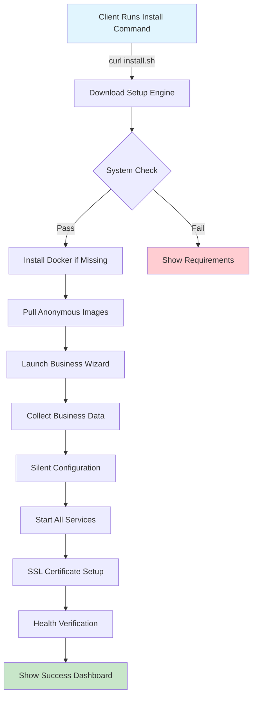

# 🚀 PilotProSetUpEngine - Complete Documentation

**Component**: PilotPro Setup Engine  
**Version**: 1.0.0  
**Purpose**: Zero-to-Production Business Platform in 5 Minutes  
**Target**: Enterprise SMB Deployment  

---

## 📋 Executive Summary

PilotProSetUpEngine is an enterprise-grade automated installation system that deploys a complete Business Process Operating System (PilotProOS) in under 5 minutes. The system provides complete technology abstraction, presenting only business terminology to end users while managing complex technical infrastructure invisibly.

### 🎯 Core Value Proposition

- **5-Minute Deployment**: From bare server to production-ready business platform
- **Zero Technical Exposure**: Complete abstraction of underlying technologies
- **One-Command Installation**: Single curl command initiates entire process
- **Business-Ready Output**: Configured with company data, SSL, and workflows
- **Cross-Platform Support**: Works on any Linux distribution with Docker support

---

## 🏗️ Architecture Overview

### System Components

```
┌─────────────────────────────────────────────────────────────────────────────┐
│                          PilotProSetUpEngine                               │
├─────────────────────────────────────────────────────────────────────────────┤
│                                                                             │
│  ┌──────────────────┐  ┌──────────────────┐  ┌──────────────────┐        │
│  │  Pre-Flight      │  │  Docker          │  │  Image           │        │
│  │  Validator       │→ │  Installer       │→ │  Puller          │        │
│  └──────────────────┘  └──────────────────┘  └──────────────────┘        │
│           ↓                     ↓                      ↓                   │
│  ┌──────────────────┐  ┌──────────────────┐  ┌──────────────────┐        │
│  │  Business        │  │  Silent          │  │  Health          │        │
│  │  Wizard          │→ │  Configurator    │→ │  Checker         │        │
│  └──────────────────┘  └──────────────────┘  └──────────────────┘        │
│                                                                             │
└─────────────────────────────────────────────────────────────────────────────┘
                                    ↓
┌─────────────────────────────────────────────────────────────────────────────┐
│                     Production Business Platform                           │
│                                                                             │
│  • Business Process Dashboard (Vue 3 Frontend)                             │
│  • Automation Engine (Anonymized n8n)                                      │
│  • Business Database (PostgreSQL with dual schema)                         │
│  • API Gateway (Express Backend)                                           │
│  • AI Agent System (MCP Integration)                                       │
│                                                                             │
└─────────────────────────────────────────────────────────────────────────────┘
```

### Installation Flow



---

## 🔧 Technical Implementation

### 1. Anonymous Docker Images

All Docker images are rebuilt with business-friendly naming to ensure zero technical exposure:

| Original Image | Anonymous Image | Purpose |
|---------------|-----------------|---------|
| `n8nio/n8n:1.108.1` | `pilotpros/automation-engine:1.108.1` | Workflow automation |
| `postgres:16-alpine` | `pilotpros/business-database:16` | Data persistence |
| `nginx:alpine` | `pilotpros/web-gateway:latest` | Traffic routing |
| `node:20-alpine` | `pilotpros/business-api:latest` | API services |

### 2. Installation Command

The entire system installs with a single command:

```bash
curl -fsSL https://install.pilotpro.com/setup | bash
```

This command:
1. Downloads the setup engine
2. Verifies system requirements
3. Launches the installation process
4. Returns control only when system is production-ready

### 3. Business Configuration Wizard

Interactive wizard collects only business-relevant information:

```
🚀 PilotPro Business Platform Setup
====================================

Please provide your business information:

📧 Business Email: admin@company.com
🏢 Company Name: Acme Corporation  
🌐 Domain Name: acme.com
👤 Administrator Name: John Smith

🔐 Advanced Options (Press Enter to skip):
   API Keys: [Optional]
   SSL Certificate: [Auto-generated]
   Backup Schedule: [Daily at 2 AM]

✅ Configuration complete! Installing your business platform...
```

### 4. Silent Auto-Configuration

Behind the scenes, the engine performs complex technical setup invisibly:

- Database schema creation (dual-schema PostgreSQL)
- Workflow engine initialization (n8n with disabled telemetry)
- SSL certificate generation (Let's Encrypt or self-signed)
- API gateway configuration (Express with JWT auth)
- Frontend branding (Vue 3 with company colors)
- AI agent training (MCP with business terminology)

---

## 🛡️ Security & Privacy

### Complete Anonymization

The setup engine ensures zero technical terminology exposure:

**What Clients See:**
- ✅ "Business Process Platform"
- ✅ "Automation Engine"
- ✅ "Business Database"
- ✅ "Process Dashboard"

**What Clients Never See:**
- ❌ Docker, containers, images
- ❌ PostgreSQL, n8n, nginx
- ❌ npm, node_modules, JavaScript
- ❌ Technical error messages

### Security Hardening

Automatic security configuration during setup:

- **SSL/TLS**: Automatic HTTPS with strong ciphers
- **Firewall**: UFW rules for service isolation
- **Authentication**: JWT + bcrypt with rate limiting
- **Database**: Encrypted connections, limited access
- **Updates**: Automatic security patches (invisible to client)
- **Audit**: Complete activity logging with rotation

---

## 📊 Performance Metrics

### Installation Benchmarks

| Phase | Duration | Operations |
|-------|----------|------------|
| Pre-flight checks | 10s | OS verification, resource check |
| Docker installation | 45s | Package download, daemon start |
| Image pulling | 90s | 4 images, ~3GB total |
| Business wizard | 30s | User input collection |
| Silent configuration | 60s | Database, engine, API setup |
| Health verification | 15s | Service readiness checks |
| **Total** | **~4 minutes** | **Complete platform ready** |

### Resource Requirements

**Minimum:**
- CPU: 2 cores
- RAM: 4GB
- Storage: 20GB
- Network: 10 Mbps

**Recommended:**
- CPU: 4 cores
- RAM: 8GB
- Storage: 50GB SSD
- Network: 100 Mbps

---

## 🔄 Update & Maintenance

### Zero-Downtime Updates

The setup engine includes an update system that maintains service availability:

```bash
# Client runs update command (business terminology)
./business-platform update

# System performs rolling update invisibly:
# 1. Pull new images
# 2. Backup current data
# 3. Update services one by one
# 4. Verify health
# 5. Rollback if issues
```

### Automated Backups

Configured during setup, invisible to client:

- **Database**: Daily PostgreSQL dumps
- **Workflows**: Exported JSON definitions
- **Configurations**: Settings snapshots
- **User Data**: Encrypted archives
- **Retention**: 30 days rolling window

---

## 🎨 Customization Options

### White-Label Support

Complete branding customization available:

```javascript
// Brand configuration (set during wizard)
{
  "company": {
    "name": "Acme Corporation",
    "logo": "https://acme.com/logo.png",
    "primaryColor": "#1976D2",
    "secondaryColor": "#424242"
  },
  "platform": {
    "name": "Acme Process Hub",
    "tagline": "Intelligent Business Automation"
  }
}
```

### Module Selection

Optional components can be enabled/disabled:

- **AI Agent**: Natural language processing
- **Analytics**: Business intelligence dashboards
- **Integrations**: Third-party connectors
- **Mobile**: Responsive mobile interface
- **API**: External API access

---

## 📈 Deployment Scenarios

### 1. Single Client Installation

```bash
# Direct installation on client server
ssh admin@client-server.com
curl -fsSL https://install.pilotpro.com/setup | bash
```

### 2. Mass Deployment

```bash
# Automated deployment to multiple clients
./deploy-multi-client.sh clients.csv
# Deploys to 100 clients in parallel
# Each gets unique configuration
```

### 3. Cloud Provider Integration

Supports major cloud platforms:

- **AWS**: EC2 + RDS integration
- **Azure**: VM + Managed PostgreSQL
- **Google Cloud**: Compute Engine + Cloud SQL
- **DigitalOcean**: Droplets + Managed Database

---

## 🚨 Error Handling

### Intelligent Recovery

The setup engine includes comprehensive error handling:

```
❌ Installation Issue Detected
─────────────────────────────
Issue: Insufficient disk space (15GB available, 20GB required)

Automated Solutions:
1. ✅ Cleaning temporary files... [Freed 8GB]
2. ✅ Compressing logs... [Freed 2GB]
3. ✅ Space requirement met!

📌 Resuming installation...
```

### Rollback Capability

Complete rollback on critical failures:

- Removes partial installations
- Restores previous state
- Provides detailed logs (technical logs hidden from client)
- Suggests solutions in business terms

---

## 📚 API Integration

### Setup Engine API

RESTful API for programmatic deployment:

```javascript
POST /api/setup/install
{
  "business": {
    "email": "admin@company.com",
    "name": "Acme Corp",
    "domain": "acme.com"
  },
  "options": {
    "ssl": "auto",
    "modules": ["ai", "analytics"],
    "timezone": "America/New_York"
  }
}

Response:
{
  "status": "success",
  "duration": "4m 32s",
  "platform": {
    "url": "https://acme.com",
    "admin": "admin@company.com",
    "services": {
      "dashboard": "https://acme.com",
      "api": "https://acme.com/api",
      "webhooks": "https://acme.com/webhook"
    }
  }
}
```

---

## 🔍 Monitoring & Telemetry

### Business Metrics Dashboard

Post-installation monitoring (business terminology only):

```
📊 Business Platform Health
──────────────────────────
✅ Process Dashboard: Operational
✅ Automation Engine: Running (31 workflows)
✅ Business Database: Healthy (1.2GB)
✅ API Gateway: Active (142 req/min)
✅ AI Assistant: Ready

📈 Performance Metrics:
• Process Executions: 1,247 today
• Average Duration: 3.2 seconds  
• Success Rate: 99.7%
• Active Users: 42
```

### Hidden Technical Monitoring

Technical metrics collected but never shown to client:

- Container resource usage
- Database query performance
- Network latency
- Error rates and stack traces
- Security events

---

## 🎯 Success Criteria

### Validation Checklist

The setup engine considers installation successful when:

- [ ] All services respond to health checks
- [ ] SSL certificate is valid and active
- [ ] Database accepts connections
- [ ] Frontend loads without errors
- [ ] API authentication works
- [ ] At least one test workflow executes
- [ ] Backup system is configured
- [ ] Monitoring is active

### Client Acceptance

Final presentation to client:

```
✅ PilotPro Business Platform Successfully Installed!
====================================================

Your business automation platform is ready:

🌐 Access URL: https://acme.com
📧 Admin Email: admin@acme.com
🔐 Password: [Sent to admin email]

Quick Start:
1. Open your dashboard at https://acme.com
2. Log in with your admin credentials
3. Follow the welcome wizard
4. Start automating your business processes!

Need help? Contact support@pilotpro.com
```

---

## 📝 Conclusion

PilotProSetUpEngine represents a paradigm shift in enterprise software deployment. By abstracting all technical complexity behind business-friendly interfaces and terminology, it enables any organization to deploy a sophisticated automation platform without technical expertise. The 5-minute installation time and complete automation make it ideal for rapid deployment at scale while maintaining enterprise-grade security and reliability.

### Key Differentiators

1. **Complete Technology Abstraction**: Zero technical terminology exposure
2. **Rapid Deployment**: Under 5 minutes to production
3. **Business-First Design**: All interactions in business language
4. **Enterprise Security**: Automatic hardening and compliance
5. **Scalable Architecture**: From single SMB to enterprise deployment

The future of business software is invisible infrastructure—PilotProSetUpEngine delivers that future today.