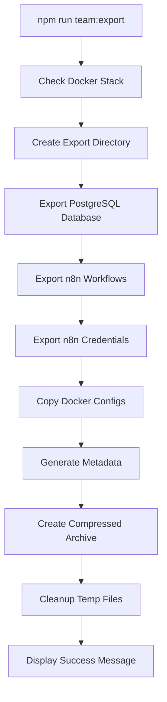
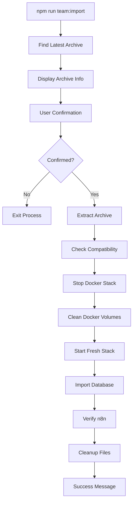

# 🚀 Team Sync System - Technical Documentation

**Feature Version**: 1.0.0  
**Status**: Production Ready  
**Created**: 2025-01-15  
**Last Updated**: 2025-01-15

## 📋 Overview

The Team Sync System is a comprehensive distributed development synchronization solution for PilotProOS, enabling multiple developers to work on separate machines while maintaining perfect data consistency across Docker stacks.

### Problem Statement

PilotProOS runs as a containerized Business Process Operating System with:
- PostgreSQL database with dual schema (n8n + pilotpros)
- n8n workflow engine with 31+ production workflows
- Complex data relationships and business logic
- Local Docker development environments

**Challenge**: How to enable 2+ developers on different machines to:
1. Share code via Git (standard)
2. Synchronize database state and workflow data
3. Maintain data integrity without conflicts
4. Enable rapid onboarding of new team members

### Solution Architecture

**Dual-Layer Synchronization Strategy**:
```
┌─────────────────────────────────────────────────────────────────┐
│                     TEAM SYNC ARCHITECTURE                     │
├─────────────────────────────────────────────────────────────────┤
│  LAYER 1: CODE SYNCHRONIZATION                                 │
│  ┌─────────────┐    GitHub    ┌─────────────┐                  │
│  │   Mac A     │ ←──────────→ │   Mac B     │                  │
│  │  Developer  │   git push   │  Developer  │                  │
│  │     A       │   git pull   │     B       │                  │
│  └─────────────┘              └─────────────┘                  │
├─────────────────────────────────────────────────────────────────┤
│  LAYER 2: DATA SYNCHRONIZATION                                 │
│  ┌─────────────┐              ┌─────────────┐                  │
│  │   Mac A     │              │   Mac B     │                  │
│  │┌───────────┐│  Export/     │┌───────────┐│                  │
│  ││PostgreSQL ││  Import      ││PostgreSQL ││                  │
│  ││+ n8n      ││ ←──────────→ ││+ n8n      ││                  │
│  ││+ Business ││  .tar.gz     ││+ Business ││                  │
│  │└───────────┘│  Archives    │└───────────┘│                  │
│  └─────────────┘              └─────────────┘                  │
└─────────────────────────────────────────────────────────────────┘
```

## 🏗 Technical Architecture

### Core Components

#### 1. Export System (`team-export.js`)
**Purpose**: Creates complete snapshot of development environment

**Components**:
- **Database Exporter**: PostgreSQL complete dump via `pg_dump`
- **Workflow Exporter**: n8n workflows + credentials via REST API
- **Configuration Exporter**: Docker configs and environment files
- **Archive Creator**: Compressed `.tar.gz` with metadata
- **Verification Layer**: Data integrity checks and statistics

**Data Flow**:
```
Docker Stack → Verification → Database Export → n8n Export → Config Export → Archive Creation → Metadata Injection
```

#### 2. Import System (`team-import.js`)
**Purpose**: Safely replaces local environment with remote data

**Components**:
- **Archive Locator**: Finds most recent export automatically
- **Compatibility Checker**: Version verification and warnings
- **Safety Layer**: Interactive confirmations for destructive operations
- **Docker Manager**: Safe stack shutdown and restart
- **Database Importer**: PostgreSQL restoration with validation
- **Verification System**: Post-import health checks

**Data Flow**:
```
Archive Discovery → Compatibility Check → User Confirmation → Docker Shutdown → Volume Cleanup → Import Execution → Stack Restart → Verification
```

#### 3. NPM Integration
**Commands Added to `package.json`**:
- `team:export` - Execute export process
- `team:import` - Execute import process  
- `team:sync` - Export + instructions for team coordination

### Data Synchronization Strategy

#### Database Layer
**PostgreSQL Dual Schema**:
```sql
-- n8n schema (36 tables)
n8n.workflow_entity
n8n.execution_entity  
n8n.credentials_entity
n8n.webhook_entity
... (32 more tables)

-- pilotpros schema (8 tables)  
pilotpros.business_analytics
pilotpros.users
pilotpros.process_templates
... (5 more tables)
```

**Export Method**: 
- Complete `pg_dump` with `--clean --if-exists` flags
- Includes both schemas, indexes, constraints, triggers
- Preserves data relationships and business logic

#### n8n Workflow Layer
**API-Based Export**:
```bash
# Workflows
GET /api/v1/workflows (authenticated)
# Credentials  
GET /api/v1/credentials (authenticated)
```

**Authentication**: HTTP Basic Auth (`admin:pilotpros_admin_2025`)
**Format**: JSON with complete node definitions and connections

#### Metadata System
**Export Tracking**:
```json
{
  "exportDate": "2025-01-15T14:30:00.000Z",
  "dockerVersion": "Docker version 20.10.21",
  "pilotproVersion": "1.0.0",
  "exportedBy": "developer1",
  "hostname": "MacBook-Pro-A.local"
}
```

## 🔧 Implementation Details

### Export Process Flow



### Import Process Flow



### Safety Mechanisms

#### Pre-Import Warnings
```bash
⚠️  ATTENZIONE: Questa operazione sovrascriverà tutti i dati attuali!
📋 Verrà eseguito:
   1. Stop Docker stack
   2. Pulizia database e volumi  
   3. Import dati dal collega
   4. Riavvio completo
   
❓ Vuoi continuare? [y/N]:
```

#### Version Compatibility
- **Same Version**: ✅ Proceed normally
- **Different Version**: ⚠️ Warning + proceed with caution
- **Missing Metadata**: ⚠️ Warning + graceful degradation

#### Rollback Strategy
- Original volumes preserved until successful import
- Failed imports leave system in recoverable state
- Manual recovery via `npm run docker:reset`

## 📂 File Structure

```
pilotproOS/
├── scripts/
│   ├── team-export.js          # Export automation script
│   └── team-import.js          # Import automation script
├── team-sync-exports/          # Export archives (gitignored)
│   ├── team-export-YYYY-MM-DD-HH-mm-ss.tar.gz
│   └── export-metadata.json
├── package.json                # NPM commands integration
├── .gitignore                  # Security exclusions
├── TEAM_WORKFLOW.md           # User guide
└── docs/
    └── team-sync-system.md     # This document
```

### Archive Contents
```
export-TIMESTAMP/
├── database-complete.sql       # PostgreSQL dump
├── workflows.json             # n8n workflows export
├── credentials.json           # n8n credentials export  
├── docker-compose.dev.yml     # Docker configuration
├── .env                       # Environment variables
├── database/init-dev/         # Database init scripts
└── export-metadata.json       # Export metadata
```

## 🔒 Security Considerations

### Data Protection
- **Local Only**: Archives never committed to Git
- **Encrypted Credentials**: n8n credentials exported in encrypted format
- **Access Control**: Requires local Docker access for import/export
- **Audit Trail**: Complete metadata tracking of all operations

### Git Integration
**Protected Files** (`.gitignore`):
```gitignore
# Team sync exports (private data - never commit)
team-sync-exports/
team-export-*.tar.gz
```

### Authentication
- **n8n API**: HTTP Basic Auth with admin credentials
- **PostgreSQL**: Local container access with service credentials
- **Docker**: Local Docker daemon access required

## ⚡ Performance Characteristics

### Export Performance
- **Database Export**: ~2-5 seconds (depends on data size)
- **Workflow Export**: ~1-2 seconds (31 workflows)
- **Archive Creation**: ~1-3 seconds (compression)
- **Total Time**: ~5-10 seconds typical

### Import Performance  
- **Docker Shutdown**: ~10-15 seconds
- **Volume Cleanup**: ~5-10 seconds
- **Stack Restart**: ~30-45 seconds (health checks)
- **Database Import**: ~10-20 seconds
- **Verification**: ~10-15 seconds
- **Total Time**: ~2-3 minutes typical

### Archive Sizes
- **Database**: ~5-20 MB (depends on execution history)
- **Workflows**: ~500KB-2MB (depends on complexity)
- **Configs**: ~10-50KB
- **Compressed Total**: ~2-10 MB typical

## 🧪 Testing Strategy

### Unit Testing
```bash
# Test export functionality
npm run team:export
# Verify archive creation and content

# Test import functionality  
npm run team:import
# Verify data restoration and stack health
```

### Integration Testing
```bash
# Full cycle test
npm run team:export    # Developer A
# Transfer archive
npm run team:import    # Developer B
# Verify identical environments
```

### Compatibility Testing
- **Cross-Version**: Test with different PilotProOS versions
- **Docker Versions**: Test with different Docker versions
- **OS Compatibility**: macOS development environment focus

## 🚨 Error Handling

### Export Errors
- **Docker Not Running**: Clear error message + exit
- **Database Connection**: Retry logic + fallback
- **API Timeout**: Extended timeout + retry
- **Disk Space**: Pre-check available space
- **Permission Issues**: Clear error messages

### Import Errors  
- **Archive Not Found**: List available archives
- **Corruption**: Archive integrity verification
- **Docker Issues**: Detailed error messages + recovery steps
- **Database Errors**: Rollback to previous state
- **Timeout**: Extended timeouts for slow systems

### Recovery Procedures
```bash
# Complete reset if import fails
npm run docker:clean
npm run dev

# Manual database recovery
npm run docker:psql
# Manual restoration commands
```

## 🔄 Maintenance and Updates

### Version Compatibility Matrix
| Export Version | Import Version | Status | Notes |
|---------------|---------------|--------|-------|
| 1.0.0 | 1.0.0 | ✅ Full | Perfect compatibility |
| 1.0.0 | 1.1.0 | ⚠️ Warning | Forward compatibility |
| 1.1.0 | 1.0.0 | ⚠️ Warning | Backward compatibility |
| Different | Different | ⚠️ Warning | Manual verification |

### Update Procedures
1. **Code Updates**: Standard Git workflow
2. **Schema Changes**: Database migration scripts
3. **Docker Updates**: Update docker-compose files
4. **n8n Updates**: Version compatibility verification

### Monitoring
- **Export Success Rate**: Track via metadata
- **Import Success Rate**: Track via logs
- **Performance Metrics**: Archive sizes, timing
- **Error Patterns**: Common failure modes

## 📊 Metrics and Analytics

### Success Metrics
- **Setup Time**: New developer onboarding < 15 minutes
- **Sync Time**: Daily sync operations < 5 minutes
- **Error Rate**: Import/export success > 95%
- **Data Integrity**: 100% data consistency post-sync

### Monitoring Dashboard
```bash
# View recent exports
ls -la team-sync-exports/

# Check archive sizes
du -h team-sync-exports/*.tar.gz

# Verify last import metadata
cat team-sync-exports/export-*/export-metadata.json
```

## 🔮 Future Enhancements

### Planned Features
- **Incremental Sync**: Delta-based updates for large databases
- **Cloud Storage**: Direct upload to Google Drive/Dropbox
- **Automated Scheduling**: Cron-based export scheduling
- **Slack Integration**: Team notifications for sync events
- **Web UI**: Browser-based sync management
- **Conflict Resolution**: Merge strategies for concurrent changes

### Architecture Evolution
- **Microservice Migration**: Separate sync service
- **API Development**: REST API for sync operations
- **Database Replication**: Real-time sync for critical data
- **Version Control**: Database change tracking
- **Multi-Team Support**: Isolate team sync boundaries

---

## 📚 Related Documentation

- **[TEAM_WORKFLOW.md](../TEAM_WORKFLOW.md)** - User workflow guide
- **[CLAUDE.md](../CLAUDE.md)** - Project overview and commands
- **[docs/architecture.md](./architecture.md)** - System architecture
- **[docs/deployment.md](./deployment.md)** - Deployment procedures

---

**Status**: ✅ Production Ready  
**Maintainer**: PilotPro Development Team  
**Last Review**: 2025-01-15