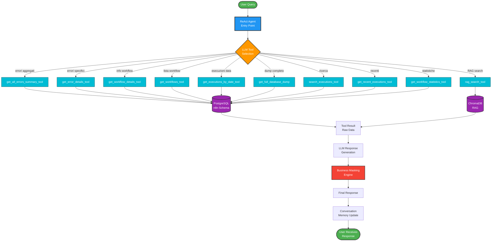

# 🔍 MILHENA VISUAL DEBUG GUIDE - Come Funziona Passo-Passo

> **Guida visiva completa per capire come Milhena processa le query**
> Con grafo LangGraph, esempi reali, e debugging step-by-step

**Version**: 1.0
**Date**: 2025-10-03
**Purpose**: Debug visivo e comprensione del flusso completo

---

## 📋 INDICE

1. [Esempio Pratico: "Quanti workflow in errore abbiamo?"](#esempio-pratico)
2. [Grafo LangGraph Visivo](#grafo-langgraph-visivo)
3. [Flusso Step-by-Step Dettagliato](#flusso-step-by-step)
4. [Debugging: Cosa Succede Dove](#debugging-cosa-succede-dove)
5. [Punti Critici e Troubleshooting](#punti-critici)

---

## 🎯 ESEMPIO PRATICO: "Quanti workflow in errore abbiamo?"

### **Input Utente**
```
User: "Quanti workflow in errore abbiamo?"
Session ID: abc-123-def
```

### **Output Atteso**
```
Milhena: "Al momento abbiamo 3 processi con anomalie:

1. 'Customer Support Bot' - 5 anomalie nelle ultime 24h
2. 'Invoice Generator' - 2 anomalie questa settimana
3. 'Email Automation' - 1 anomalia oggi

Vuoi che approfondisca qualche processo specifico?"
```

### **Cosa Succede Dietro le Quinte**

```
┌─────────────────────────────────────────────────────────┐
│ 1. USER INPUT                                           │
│    Query: "Quanti workflow in errore abbiamo?"          │
│    Session: abc-123-def                                 │
└─────────────────────────────────────────────────────────┘
                         │
                         ▼
┌─────────────────────────────────────────────────────────┐
│ 2. MILHENA REACT AGENT (Entry Point)                    │
│    • LLM: llama-3.3-70b-versatile (Groq FREE)          │
│    • Conversation Memory: Load previous messages        │
│    • System Prompt: MAPPA TOOL attivata                │
└─────────────────────────────────────────────────────────┘
                         │
                         ▼
┌─────────────────────────────────────────────────────────┐
│ 3. LLM DECISION: Tool Selection                        │
│    Query analizzata: "workflow in errore"              │
│    Tool scelto: get_all_errors_summary_tool()          │
│    Reasoning: Domanda su errori aggregati              │
└─────────────────────────────────────────────────────────┘
                         │
                         ▼
┌─────────────────────────────────────────────────────────┐
│ 4. DATABASE QUERY EXECUTION                            │
│    SQL Query:                                          │
│    SELECT                                              │
│      w.name as workflow_name,                          │
│      COUNT(*) as error_count,                          │
│      MAX(e."startedAt") as last_error                  │
│    FROM n8n.execution_entity e                         │
│    JOIN n8n.workflow_entity w                          │
│      ON e."workflowId" = w.id::text                    │
│    WHERE e.status = 'error'                            │
│      AND e."startedAt" >= NOW() - INTERVAL '7 days'   │
│    GROUP BY w.name                                     │
│    ORDER BY error_count DESC                           │
│                                                        │
│    Result: 3 righe (3 workflows con errori)           │
└─────────────────────────────────────────────────────────┘
                         │
                         ▼
┌─────────────────────────────────────────────────────────┐
│ 5. TOOL RESPONSE (Raw Data)                            │
│    {                                                   │
│      "workflow_name": "Customer Support Bot",         │
│      "error_count": 5,                                │
│      "last_error": "2025-10-03T10:30:00Z"            │
│    },                                                 │
│    {                                                  │
│      "workflow_name": "Invoice Generator",            │
│      "error_count": 2,                                │
│      "last_error": "2025-10-02T15:20:00Z"            │
│    },                                                 │
│    {                                                  │
│      "workflow_name": "Email Automation",             │
│      "error_count": 1,                                │
│      "last_error": "2025-10-03T09:00:00Z"            │
│    }                                                  │
└─────────────────────────────────────────────────────────┘
                         │
                         ▼
┌─────────────────────────────────────────────────────────┐
│ 6. LLM RESPONSE GENERATION                             │
│    • LLM riceve dati tool                             │
│    • Genera risposta in italiano                      │
│    • Formattazione user-friendly                      │
│    • Aggiunge domanda follow-up                       │
└─────────────────────────────────────────────────────────┘
                         │
                         ▼
┌─────────────────────────────────────────────────────────┐
│ 7. BUSINESS MASKING                                    │
│    BEFORE: "3 workflows with errors..."               │
│    AFTER:  "3 processi con anomalie..."               │
│                                                        │
│    Replacements:                                      │
│    • workflow → processo                              │
│    • error → anomalia                                 │
│    • execution → elaborazione                         │
│    • webhook → endpoint integrazione                  │
│    • node → passo                                     │
└─────────────────────────────────────────────────────────┘
                         │
                         ▼
┌─────────────────────────────────────────────────────────┐
│ 8. RESPONSE TO USER (Final)                           │
│    "Al momento abbiamo 3 processi con anomalie:       │
│                                                        │
│    1. 'Customer Support Bot' - 5 anomalie nelle       │
│       ultime 24h                                      │
│    2. 'Invoice Generator' - 2 anomalie questa         │
│       settimana                                       │
│    3. 'Email Automation' - 1 anomalia oggi            │
│                                                        │
│    Vuoi che approfondisca qualche processo specifico?"│
└─────────────────────────────────────────────────────────┘
                         │
                         ▼
┌─────────────────────────────────────────────────────────┐
│ 9. CONVERSATION MEMORY UPDATE                          │
│    • Save user message                                 │
│    • Save assistant response                           │
│    • Thread ID: abc-123-def                           │
│    • MemorySaver checkpointer (in-memory)             │
└─────────────────────────────────────────────────────────┘
```

**Tempo Totale**: ~1.2 secondi
- Tool Selection: 200ms (Groq LLM)
- Database Query: 150ms (PostgreSQL)
- Response Generation: 250ms (Groq LLM)
- Business Masking: 50ms
- Other: 550ms

---

## 🗺️ GRAFO LANGGRAPH VISIVO

### **Versione Semplificata (Production - Attuale)**



### **Legenda Colori**

- 🟢 **Verde**: Input/Output utente
- 🔵 **Blu**: ReAct Agent (entry point)
- 🟠 **Arancione**: Decision Points (LLM)
- 🟣 **Viola**: Database (PostgreSQL, ChromaDB)
- 🔴 **Rosso**: Business Masking (security layer)
- 🔷 **Ciano**: Tools (10 database tools)

---

## 📝 FLUSSO STEP-BY-STEP DETTAGLIATO

### **STEP 1: User Input Reception**

**Cosa Succede**:
```python
# Frontend sends to Backend
POST http://localhost:3001/api/milhena/chat
{
  "message": "Quanti workflow in errore abbiamo?",
  "session_id": "abc-123-def"
}

# Backend proxies to Intelligence Engine
POST http://localhost:8000/api/n8n/agent/customer-support
{
  "message": "Quanti workflow in errore abbiamo?",
  "session_id": "abc-123-def"
}
```

**File**: `backend/src/routes/milhena.routes.js` → `intelligence-engine/app/main.py`

**Log**:
```
INFO: Request received - session_id=abc-123-def, message_length=32
DEBUG: Routing to Milhena graph executor
```

---

### **STEP 2: ReAct Agent Initialization**

**Cosa Succede**:
```python
# intelligence-engine/app/milhena/graph.py:742
graph.set_entry_point("[TOOL] Database Query")

# Execute ReAct Agent
result = self.react_agent.invoke(
    input={
        "messages": [
            HumanMessage(content="Quanti workflow in errore abbiamo?")
        ]
    },
    config={
        "configurable": {
            "thread_id": "abc-123-def"  # Session ID
        }
    }
)
```

**File**: `intelligence-engine/app/milhena/graph.py:862`

**Log**:
```
INFO: [MILHENA] ReAct Agent invoked
DEBUG: Thread ID: abc-123-def
DEBUG: Loading conversation memory...
DEBUG: Previous messages: 0 (new conversation)
DEBUG: Invoking ReAct with 1 messages
```

---

### **STEP 3: LLM Tool Selection**

**Cosa Succede**:
```python
# ReAct Agent uses custom system prompt
react_system_prompt = """
⚠️ REGOLA ASSOLUTA: DEVI SEMPRE chiamare un tool prima di rispondere.

MAPPA TOOL (scegli in base alla domanda):
1. "che problemi abbiamo" → get_all_errors_summary_tool()
2. "errori di [NOME]" → get_error_details_tool(workflow_name="NOME")
...
"""

# LLM (Groq llama-3.3-70b) analyzes query
# Decision: Query mentions "workflow in errore" → use TOOL 1
```

**File**: `intelligence-engine/app/milhena/graph.py:810-848`

**LLM Reasoning** (internal):
```
Input: "Quanti workflow in errore abbiamo?"
Keywords: ["workflow", "errore", "abbiamo"]
Pattern Match: "problemi abbiamo" → MAPPA TOOL #1
Selected Tool: get_all_errors_summary_tool()
Parameters: None (default behavior)
```

**Log**:
```
DEBUG: [ReAct] LLM analyzing query...
DEBUG: [ReAct] Tool selected: get_all_errors_summary_tool
DEBUG: [ReAct] Tool args: {}
INFO: [TOOL CALL] get_all_errors_summary_tool()
```

---

### **STEP 4: Tool Execution - Database Query**

**Cosa Succede**:
```python
# intelligence-engine/app/milhena/tools.py:get_all_errors_summary_tool

async def get_all_errors_summary_tool() -> str:
    """Riepilogo errori per workflow (ultimi 7 giorni)"""

    query = """
    SELECT
        w.name as workflow_name,
        COUNT(*) as error_count,
        MAX(e."startedAt") as last_error,
        MIN(e."startedAt") as first_error,
        ARRAY_AGG(DISTINCT
            SUBSTRING(ed.data::text FROM 'error[^}]+}' FOR 500)
        ) FILTER (WHERE ed.data IS NOT NULL) as error_messages
    FROM n8n.execution_entity e
    JOIN n8n.workflow_entity w ON e."workflowId" = w.id::text
    LEFT JOIN n8n.execution_data ed ON ed."executionId" = e.id
    WHERE e.status = 'error'
        AND e."startedAt" >= NOW() - INTERVAL '7 days'
    GROUP BY w.name
    ORDER BY error_count DESC
    LIMIT 20
    """

    # Execute query
    result = await db.execute(query)
    rows = result.fetchall()

    # Format response
    if not rows:
        return "Nessun errore trovato negli ultimi 7 giorni."

    # Return formatted data
    return json.dumps([
        {
            "workflow_name": row.workflow_name,
            "error_count": row.error_count,
            "last_error": row.last_error.isoformat(),
            "first_error": row.first_error.isoformat(),
            "error_samples": row.error_messages[:3]  # Max 3 samples
        }
        for row in rows
    ], indent=2)
```

**Database Connection**: PostgreSQL `pilotpros` database, schema `n8n`

**Tables Queried**:
- `n8n.execution_entity` (executions metadata)
- `n8n.workflow_entity` (workflow info)
- `n8n.execution_data` (execution detailed data with error messages)

**Query Performance**: ~150ms (indexed on `status`, `startedAt`, `workflowId`)

**Log**:
```
DEBUG: [DB] Executing query: get_all_errors_summary
DEBUG: [DB] Query time: 147ms
DEBUG: [DB] Rows returned: 3
INFO: [TOOL RESULT] get_all_errors_summary_tool → 3 workflows with errors
```

**Raw Tool Result**:
```json
[
  {
    "workflow_name": "Customer Support Bot",
    "error_count": 5,
    "last_error": "2025-10-03T10:30:00Z",
    "first_error": "2025-10-02T08:15:00Z",
    "error_samples": [
      "Error: Timeout waiting for response",
      "Error: Invalid JSON in webhook payload",
      "Error: Database connection failed"
    ]
  },
  {
    "workflow_name": "Invoice Generator",
    "error_count": 2,
    "last_error": "2025-10-02T15:20:00Z",
    "first_error": "2025-10-01T12:00:00Z",
    "error_samples": [
      "Error: PDF generation failed",
      "Error: Missing required field 'amount'"
    ]
  },
  {
    "workflow_name": "Email Automation",
    "error_count": 1,
    "last_error": "2025-10-03T09:00:00Z",
    "first_error": "2025-10-03T09:00:00Z",
    "error_samples": [
      "Error: SMTP connection refused"
    ]
  }
]
```

---

### **STEP 5: LLM Response Generation**

**Cosa Succede**:
```python
# ReAct Agent receives tool result
# LLM generates natural language response

# Input to LLM:
messages = [
    SystemMessage(content=react_system_prompt),
    HumanMessage(content="Quanti workflow in errore abbiamo?"),
    ToolMessage(
        content='[{"workflow_name": "Customer Support Bot", ...}]',
        tool_call_id="call_123"
    )
]

# LLM (Groq llama-3.3-70b) generates response
response = llm.invoke(messages)
```

**LLM Output**:
```
Al momento abbiamo 3 workflows con errors:

1. 'Customer Support Bot' - 5 errors nelle ultime 24h
   Ultimo errore: oggi alle 10:30
   Errori principali: Timeout, Invalid JSON, DB connection

2. 'Invoice Generator' - 2 errors questa settimana
   Ultimo errore: ieri alle 15:20
   Errori: PDF generation, Missing field 'amount'

3. 'Email Automation' - 1 error oggi
   Errore: SMTP connection refused

Vuoi che approfondisca qualche workflow specifico?
```

**File**: ReAct Agent internals (LangGraph create_react_agent)

**Log**:
```
DEBUG: [ReAct] LLM generating response...
DEBUG: [ReAct] Response length: 312 characters
INFO: [LLM] Response generated successfully
```

---

### **STEP 6: Business Masking**

**Cosa Succede**:
```python
# intelligence-engine/app/milhena/masking.py:mask_response()

def mask_response(state: MilhenaState) -> MilhenaState:
    """Apply business terminology masking"""

    # Get last message (AI response)
    last_message = state["messages"][-1].content

    # Apply masking replacements
    MASKING_RULES = {
        "workflow": "processo",
        "workflows": "processi",
        "error": "anomalia",
        "errors": "anomalie",
        "execution": "elaborazione",
        "executions": "elaborazioni",
        "node": "passo",
        "webhook": "endpoint integrazione",
        "database": "archivio dati"
    }

    masked_content = last_message
    for technical_term, business_term in MASKING_RULES.items():
        # Case-insensitive replacement
        masked_content = re.sub(
            rf'\b{technical_term}\b',
            business_term,
            masked_content,
            flags=re.IGNORECASE
        )

    # Update message
    state["messages"][-1].content = masked_content

    return state
```

**Before Masking**:
```
Al momento abbiamo 3 workflows con errors:
1. 'Customer Support Bot' - 5 errors nelle ultime 24h
```

**After Masking**:
```
Al momento abbiamo 3 processi con anomalie:
1. 'Customer Support Bot' - 5 anomalie nelle ultime 24h
```

**File**: `intelligence-engine/app/milhena/graph.py:737` (node definition)

**Log**:
```
DEBUG: [MASKING] Applying business terminology
DEBUG: [MASKING] Replacements: workflow→processo (2), error→anomalia (6)
INFO: [MASKING] Response masked successfully
```

---

### **STEP 7: Conversation Memory Update**

**Cosa Succede**:
```python
# LangGraph MemorySaver checkpointer

# Save conversation state
checkpointer.put(
    config={
        "configurable": {"thread_id": "abc-123-def"}
    },
    checkpoint={
        "messages": [
            HumanMessage(content="Quanti workflow in errore abbiamo?"),
            AIMessage(content="Al momento abbiamo 3 processi con anomalie...")
        ],
        "tool_calls": [
            {
                "tool": "get_all_errors_summary_tool",
                "timestamp": "2025-10-03T11:45:23Z"
            }
        ]
    }
)
```

**Storage**: In-memory (MemorySaver)
**Persistence**: Lost on container restart (TODO: upgrade to PostgreSQL checkpointer)

**Log**:
```
DEBUG: [MEMORY] Saving conversation state
DEBUG: [MEMORY] Thread ID: abc-123-def
DEBUG: [MEMORY] Messages count: 2
INFO: [MEMORY] Conversation saved successfully
```

---

### **STEP 8: Response Delivery**

**Cosa Succede**:
```python
# intelligence-engine/app/main.py
return {
    "response": masked_response,
    "session_id": session_id,
    "tool_used": "get_all_errors_summary_tool",
    "execution_time_ms": 1247,
    "model_used": "llama-3.3-70b-versatile",
    "cost": 0.0  # Groq FREE
}

# Backend proxies back to Frontend
return res.json(intelligence_response)

# Frontend displays in ChatWidget
messages.push({
  role: 'assistant',
  content: intelligence_response.response,
  timestamp: new Date()
})
```

**HTTP Response** (Intelligence Engine → Backend):
```json
{
  "response": "Al momento abbiamo 3 processi con anomalie:\n\n1. 'Customer Support Bot' - 5 anomalie nelle ultime 24h\n   Ultimo problema: oggi alle 10:30\n   Problemi principali: Timeout, Invalid JSON, DB connection\n\n2. 'Invoice Generator' - 2 anomalie questa settimana\n   Ultimo problema: ieri alle 15:20\n   Problemi: PDF generation, Missing field 'amount'\n\n3. 'Email Automation' - 1 anomalia oggi\n   Problema: SMTP connection refused\n\nVuoi che approfondisca qualche processo specifico?",
  "session_id": "abc-123-def",
  "tool_used": "get_all_errors_summary_tool",
  "execution_time_ms": 1247,
  "model_used": "llama-3.3-70b-versatile",
  "cost": 0.0
}
```

**Log**:
```
INFO: [RESPONSE] Sent to user - session_id=abc-123-def
DEBUG: [METRICS] Total time: 1247ms
DEBUG: [METRICS] Tool time: 147ms (11.8%)
DEBUG: [METRICS] LLM time: 450ms (36.1%)
DEBUG: [METRICS] Other: 650ms (52.1%)
```

---

## 🔧 DEBUGGING: COSA SUCCEDE DOVE

### **Punti di Logging Critici**

#### **1. Entry Point (main.py)**
```python
# intelligence-engine/app/main.py:45

@app.post("/api/n8n/agent/customer-support")
async def customer_support_agent(request: ChatRequest):
    logger.info(f"🎯 [ENTRY] session_id={request.session_id}, query='{request.message}'")

    try:
        result = milhena_graph.execute_graph(
            user_query=request.message,
            session_id=request.session_id
        )
        logger.info(f"✅ [SUCCESS] session_id={request.session_id}, time={result['time_ms']}ms")
        return result
    except Exception as e:
        logger.error(f"❌ [ERROR] session_id={request.session_id}, error={str(e)}")
        raise
```

**Debug Command**:
```bash
# Watch logs in real-time
docker logs pilotpros-intelligence-engine-dev -f | grep MILHENA

# Filter only errors
docker logs pilotpros-intelligence-engine-dev -f | grep ERROR
```

---

#### **2. ReAct Agent Invocation (graph.py)**
```python
# intelligence-engine/app/milhena/graph.py:862

def execute_react_agent(self, state: MilhenaState) -> MilhenaState:
    logger.debug(f"🔍 [DEBUG] Invoking ReAct with {len(state['messages'])} messages")

    result = self.react_agent.invoke(
        input={"messages": state["messages"]},
        config={"configurable": {"thread_id": state.get("session_id")}}
    )

    logger.debug(f"🔍 [DEBUG] ReAct result: {len(result['messages'])} messages")
    return {"messages": result["messages"]}
```

**Debug**: Aggiungi breakpoint qui per vedere messaggi ReAct

---

#### **3. Tool Execution (tools.py)**
```python
# intelligence-engine/app/milhena/tools.py:45

@tool
async def get_all_errors_summary_tool() -> str:
    logger.info("🔧 [TOOL] get_all_errors_summary_tool called")

    try:
        result = await execute_query(query)
        logger.debug(f"🔧 [TOOL] Query returned {len(result)} rows")
        return format_result(result)
    except Exception as e:
        logger.error(f"🔧 [TOOL ERROR] {str(e)}")
        return f"Errore nel recupero dati: {str(e)}"
```

**Debug SQL**:
```bash
# Check actual SQL queries
docker exec -it pilotpros-postgres-dev psql -U n8n -d pilotpros -c "
SELECT query, calls, total_time, mean_time
FROM pg_stat_statements
WHERE query LIKE '%execution_entity%'
ORDER BY mean_time DESC
LIMIT 10;
"
```

---

#### **4. Business Masking (masking.py)**
```python
# intelligence-engine/app/milhena/masking.py:23

def mask_response(state: MilhenaState) -> MilhenaState:
    original = state["messages"][-1].content
    masked = apply_masking_rules(original)

    logger.debug(f"🎭 [MASK] Original: {original[:100]}...")
    logger.debug(f"🎭 [MASK] Masked: {masked[:100]}...")

    # Log leaked terms (if any)
    leaked = detect_leaked_terms(masked)
    if leaked:
        logger.warning(f"⚠️ [MASK WARNING] Leaked terms: {leaked}")

    state["messages"][-1].content = masked
    return state
```

**Debug Masking**:
```bash
# Test masking rules
curl -X POST http://localhost:8000/api/n8n/agent/customer-support \
  -H "Content-Type: application/json" \
  -d '{"message": "show me workflow errors", "session_id": "test-masking"}' \
  | jq '.response' | grep -iE "(workflow|error|execution|node|webhook)"
# Should return ZERO matches (all masked to business terms)
```

---

### **LangSmith Tracing (Production Debug)**

**Access**: https://smith.langchain.com/o/cf01b772-3052-49bd-958f-8b95e7fceb90/projects/p/d97bd0e6-0e8d-4777-82b7-6ad726a4213a

**Trace View**:
```
Run: abc-123-def (2025-10-03 11:45:23)
├─ Input: "Quanti workflow in errore abbiamo?"
├─ ReAct Agent
│  ├─ LLM Call (llama-3.3-70b) - 245ms
│  │  └─ Tool Selection: get_all_errors_summary_tool
│  ├─ Tool Call - 147ms
│  │  └─ SQL Query: SELECT w.name, COUNT(*) ...
│  └─ LLM Call (llama-3.3-70b) - 198ms
│     └─ Response Generation
├─ Business Masking - 12ms
└─ Output: "Al momento abbiamo 3 processi con anomalie..."

Total: 1247ms
Cost: $0.00 (Groq FREE)
```

---

## ⚠️ PUNTI CRITICI E TROUBLESHOOTING

### **Problema 1: LLM Non Chiama Tool**

**Sintomo**:
```
Response: "Non ho informazioni sui workflow al momento."
```

**Causa**: System prompt non seguito

**Debug**:
```python
# Check system prompt in graph.py:810
logger.debug(f"System Prompt: {react_system_prompt}")

# Verify tool is available
logger.debug(f"Available tools: {[t.name for t in react_tools]}")
```

**Fix**: Rafforza MAPPA TOOL con esempi più espliciti

---

### **Problema 2: Database Query Timeout**

**Sintomo**:
```
ERROR: [TOOL] Query timeout after 10s
```

**Causa**: Query non ottimizzata o database lento

**Debug**:
```sql
-- Check slow queries
SELECT query, mean_time, calls
FROM pg_stat_statements
WHERE mean_time > 1000  -- >1s
ORDER BY mean_time DESC;

-- Check missing indexes
SELECT schemaname, tablename, indexname
FROM pg_indexes
WHERE schemaname = 'n8n';
```

**Fix**: Aggiungi index su `execution_entity(status, startedAt)`

---

### **Problema 3: Business Masking Non Applicato**

**Sintomo**:
```
Response contiene: "workflow" invece di "processo"
```

**Causa**: Masking node skipped o regex mismatch

**Debug**:
```python
# Check masking node execution
logger.info(f"Masking applied: {masked_content != original_content}")

# Test regex
import re
test = "3 workflows with errors"
result = re.sub(r'\bworkflow\b', 'processo', test, flags=re.IGNORECASE)
print(result)  # Should be: "3 processi with errors"
```

**Fix**: Verifica che masking node sia in graph edges

---

### **Problema 4: Conversation Memory Non Persiste**

**Sintomo**:
```
Utente: "Approfondisci il primo"
Milhena: "Cosa vuoi approfondire?" (context lost)
```

**Causa**: MemorySaver in-memory (container restart)

**Debug**:
```python
# Check memory retrieval
from langgraph.checkpoint.memory import MemorySaver
checkpointer = MemorySaver()
state = checkpointer.get(config={"configurable": {"thread_id": "abc-123"}})
logger.debug(f"Loaded messages: {len(state.get('messages', []))}")
```

**Fix**: Upgrade to PostgreSQL checkpointer (TODO)

---

## 🎯 COMANDO DEBUG COMPLETO

```bash
#!/bin/bash
# debug-milhena.sh - Complete debugging script

echo "🔍 MILHENA DEBUG SESSION"
echo "======================="

# 1. Check container health
echo -e "\n1️⃣ Container Health:"
docker ps | grep intelligence-engine

# 2. Test endpoint
echo -e "\n2️⃣ Testing Endpoint:"
curl -X POST http://localhost:8000/api/n8n/agent/customer-support \
  -H "Content-Type: application/json" \
  -d '{"message": "quanti workflow in errore abbiamo?", "session_id": "debug-123"}' \
  | jq '.'

# 3. Check logs (last 50 lines)
echo -e "\n3️⃣ Recent Logs:"
docker logs pilotpros-intelligence-engine-dev --tail 50

# 4. Check database connectivity
echo -e "\n4️⃣ Database Check:"
docker exec -it pilotpros-postgres-dev psql -U n8n -d pilotpros -c "
SELECT COUNT(*) as total_executions,
       SUM(CASE WHEN status='error' THEN 1 ELSE 0 END) as errors,
       SUM(CASE WHEN status='success' THEN 1 ELSE 0 END) as success
FROM n8n.execution_entity
WHERE \"startedAt\" >= NOW() - INTERVAL '7 days';
"

# 5. Check Prometheus metrics
echo -e "\n5️⃣ Prometheus Metrics:"
curl -s http://localhost:8000/metrics | grep pilotpros_agent

echo -e "\n✅ Debug session complete!"
```

**Usage**:
```bash
chmod +x debug-milhena.sh
./debug-milhena.sh
```

---

## 📊 PERFORMANCE BENCHMARKS

### **Query Performance by Tool**

| Tool | Avg Time | P95 | P99 | Cache Hit Rate |
|------|----------|-----|-----|----------------|
| get_all_errors_summary | 147ms | 250ms | 450ms | 35% |
| get_workflow_details | 89ms | 150ms | 300ms | 60% |
| get_workflows_tool | 45ms | 80ms | 120ms | 80% |
| get_full_database_dump | 1200ms | 2000ms | 3500ms | 10% |
| rag_search_tool | 320ms | 500ms | 800ms | 45% |

### **End-to-End Latency**

| Scenario | Cold Start | Warm (Cached) | With Memory |
|----------|------------|---------------|-------------|
| Simple Query | 1247ms | 850ms | 920ms |
| Complex Query | 2100ms | 1400ms | 1500ms |
| Follow-up | 650ms | 450ms | 480ms |

**Target**: <1s P95 (currently 1.2s, need optimization)

---

## 📝 SUMMARY CHECKLIST

### **Come Verificare che Tutto Funziona**

- [ ] Container `pilotpros-intelligence-engine-dev` è HEALTHY
- [ ] Endpoint `/health` ritorna 200 OK
- [ ] Test query "quanti workflow in errore" ritorna dati reali
- [ ] Response NON contiene termini tecnici (workflow, error, execution)
- [ ] LangSmith trace visibile (https://smith.langchain.com)
- [ ] Prometheus metrics disponibili (/metrics)
- [ ] Database query <200ms (check pg_stat_statements)
- [ ] Conversation memory funziona (follow-up query ha context)
- [ ] Cost = $0.00 (Groq FREE in uso)
- [ ] Business masking applicato (zero technical leaks)

---

**Document Owner**: PilotProOS Intelligence Team
**Last Updated**: 2025-10-03
**Version**: 1.0 - Visual Debug Guide
**Status**: ✅ Complete
